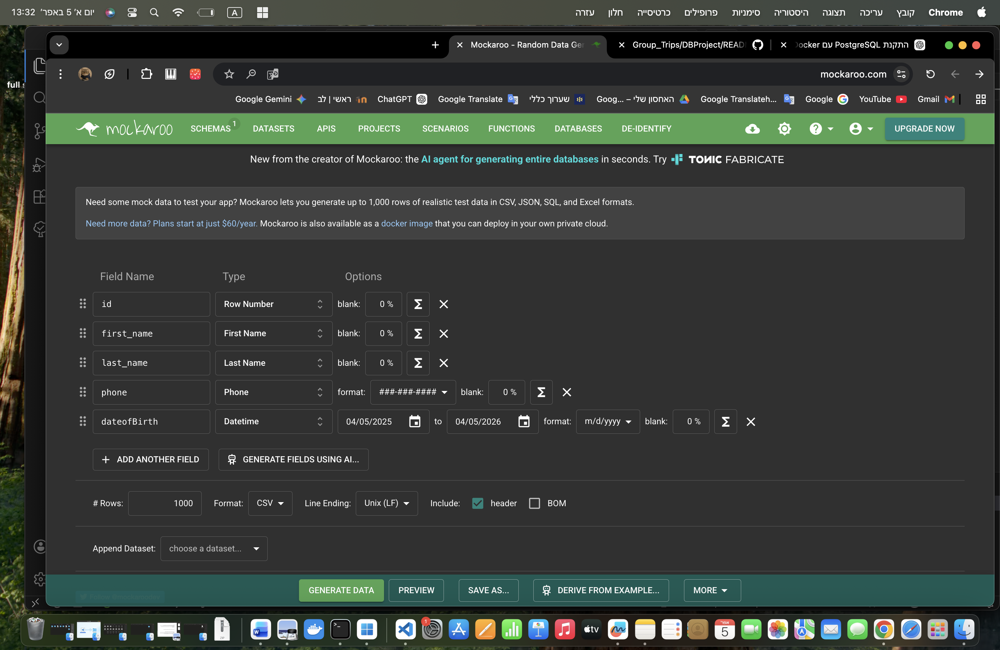

# Group Trips Database System

# Ruth Ulman 325442259
# Michal Swissa 326002813


## Table of Contents

- [Introduction](#introduction)
- [System Screens (Google AI Studio)](#system-screens-google-ai-studio)
  - [Trips Management Screen](#trips-management-screen)
  - [Transport Types Screen](#transport-types-screen)
  - [Participants Management Screen](#participants-management-screen)
  - [Guides Management Screen](#guides-management-screen)
  - [Trips Detailed View](#trips-detailed-view)
  - [Events Screen](#events-screen)
  - [Schedule Screen](#schedule-screen)
  - [Activities Screen](#activities-screen)
- [Database Design](#database-design)
  - [ERD Diagram](#erd-diagram)
  - [DSD Diagram](#dsd-diagram)
  - [Design Decisions](#design-decisions)
- [SQL Scripts](#sql-scripts)
- [Data Insertion Methods](#data-insertion-methods)
  - [Manual SQL INSERT](#1-manual-sql-insert-table-actions)
  - [Python Direct Insertion](#2-python-direct-insertion-table-actions)
  - [CSV File Insertion](#3-csv-file-insertion-table-routes)
  - [External Data Source – Mockaroo](#4-external-data-source--mockaroo-table-participants)
- [Backup & Restore](#backup--restore)
- [Summary](#summary)
- [Project Structure](#project-structure)
- [How to Run the Project](#how-to-run-the-project)


## Introduction

This project presents the design and implementation of a relational database system for managing organized group trips.

The system manages key entities such as participants, trips, guides, routes, schedules, events, and actions. It allows tracking trip activities, organizing participants into trips, and maintaining structured and consistent data.

The system was designed using a top-down approach. First, system screens were defined using AI tools, and based on them, a relational database schema was created using ERDPlus. The database was normalized to Third Normal Form (3NF) to ensure data consistency and eliminate redundancy.

The project also demonstrates multiple methods of data insertion, including SQL INSERT statements, CSV file import using PostgreSQL COPY, direct insertion using Python, and external data generation using Mockaroo.

Finally, the database was backed up and restored to verify data integrity and system reliability.

## System Screens (Google AI Studio)

The system interface was designed using Google AI Studio as part of the top-down design approach. These screens define the main functionality of the system and guided the database design.

### Trips Management Screen
This screen presents all available trips, including key details such as destination, duration, distance, and assigned transport type.


### Transport Types Screen
Displays the available transportation options used in the system, such as buses, private vehicles, and off-road vehicles.


### Participants Management Screen
Shows all participants registered in the system, including personal details such as name, phone number, and email.


### Guides Management Screen
Displays all guides in the system, including their experience, license information, and contact details.


### Trips Detailed View
Provides detailed information about each trip, including assigned route, guide, and number of participants.


### Events Screen
Displays events related to trips, including date, time, and pricing details.


### Schedule Screen
Shows the timeline of activities within a trip, allowing structured planning of events and actions.


### Activities Screen
Displays all activities available in the system, such as games or food-related events.


## Database Design

The database schema was designed using ERDPlus and includes the main entities required for the system, their attributes, and the relationships between them.

### ERD Diagram
The Entity Relationship Diagram presents the logical design of the system, including the main entities and their relationships.


### DSD Diagram
The Database Schema Diagram presents the relational schema after conversion from the ERD model into database tables.


### Design Decisions
The database was designed to ensure:
- clear entity separation
- proper use of primary and foreign keys
- support for many-to-many relationships through linking tables
- reduction of redundancy
- normalization up to Third Normal Form (3NF)


## SQL Scripts

The following SQL scripts were created and used in the project:

- [Create Tables](init-db/01-create-tables.sql)
- [Drop Tables](init-db/dropTables.sql)
- [Insert Data](init-db/insertTables.sql)
- [Select Queries](init-db/selectAll.sql)
- [Load Data from CSV](init-db/loadFromCsv.sql)

### Additional Scripts
- [Count Rows](init-db/countRows.sql)

### Python Scripts
- [Generate Data](scripts/generate_data.py)
- [Append Data Directly (Python)](scripts/append_data_direct.py)


### Data Insertion Run Commands (Quick Reference)

If you need to demonstrate or execute each of the data insertion methods for the lecturer without restarting the database, run these commands in your terminal (from the `DBProject` directory):

#### 1. Manual SQL INSERT
To run a manual SQL insert command directly on the database container:
```bash
docker exec -it PostgreSQL_DB psql -U postgres -d group_trips_db -c "INSERT INTO actions (address, action_type, action_name, event_id) VALUES ('Tel Aviv', 'Manual Insert', 'Test Action Manual', 1);"
```

#### 2. Python Direct Insertion
To run the Python script that appends new rows directly to all 9 tables in the live database:
```bash
python3 scripts/append_data_direct.py
```

#### 3. CSV File Insertion
To import data from a CSV file (e.g., loading new routes) using the PostgreSQL COPY command in the running container:
```bash
docker exec -it PostgreSQL_DB psql -U postgres -d group_trips_db -c "\copy routes(route_name, region, distance_km, duration_hours, difficulty_level) FROM '/tmp/data/routes.csv' DELIMITER ',' CSV HEADER;"
```

#### 4. External Data Source (Mockaroo CSV Import)
To import Mockaroo-generated datasets (e.g., participants CSV) directly into the database:
```bash
docker exec -it PostgreSQL_DB psql -U postgres -d group_trips_db -c "\copy participants(first_name, last_name, phone, email, birth_date) FROM '/tmp/data/participants.csv' DELIMITER ',' CSV HEADER;"
```

---

### Data Insertion Methods Detailed Documentation

In this section, we document all required data insertion methods, including screenshots before and after each process.

---

#### 1. Manual SQL INSERT (Table: actions)

We inserted a new record manually into the `actions` table using an SQL INSERT command.
The inserted record included the following values: address "Tel Aviv", action type "Manual Insert", action name "Test Action Manual", and event ID 1.

After executing the query, we verified the insertion by retrieving the latest records from the table and confirming that the new row was successfully added.


---

#### 2. Python Direct Insertion (Table: actions)

We used a Python script (`append_data_direct.py`) to insert data directly into the database.  
This script programmatically inserts new routes, transport types, participants, guides, trips, schedules, events, and actions.

After running the script, we verified the insertion by checking the total number of rows in the table and confirming that the count increased accordingly.


---

#### 3. CSV File Insertion (Table: routes)

We inserted data into the `routes` table using a CSV file and PostgreSQL COPY command.

Before performing the insertion, the table contained only the original dataset:


We then prepared a CSV file containing the new route data:


After executing the COPY command, the new data was successfully inserted into the table.


---

#### 4. External Data Source – Mockaroo (Table: participants)

We generated a large dataset of participants using the Mockaroo platform and imported it into the database.

This allowed us to efficiently populate the `participants` table with realistic test data.




After the import, we verified that the table contains 20,500 records.

---

### Backup & Restore

#### Backup

We created a full backup of the database using pgAdmin to ensure data safety and recovery capability.


The backup file created:
backup_2026-04-03.backup

---

#### Restore

We restored the database into a separate database named `group_trips_restore` using the backup file.


The restore process completed successfully, and all data was fully recovered and verified.

---

### Summary

All required data insertion methods were successfully implemented and validated:

- Manual SQL insertion into the `actions` table
- Python-based insertion into the `actions` table
- CSV-based insertion into the `routes` table
- External data generation using Mockaroo for the `participants` table
- Full database backup and restore operations

Each step was documented and verified using screenshots.


## Project Structure

- data/ – CSV files used for data insertion
- images/ – screenshots and diagrams
- init-db/ – SQL scripts for database setup
- scripts/ – Python scripts for data generation and insertion
- README.md – project documentation


## איך להריץ את הפרויקט (לשותפים למטלה / אחרי Pull)

כשמורידים את הפרויקט למחשב חדש, יש לבצע את השלבים הבאים כדי להריץ את מסד הנתונים:

### 1. הפעלת המסד ו-pgAdmin
1. פתחו את הטרמינל (Terminal) ונווטו לתיקייה `DBProject`.
2. הריצו את הפקודה הבאה כדי להפעיל את PostgreSQL ו-pgAdmin:
   ```bash
   docker compose up -d
   ```
   *הערה: בזכות ההגדרות שלנו, הפקודה הזו גם תיצור את כל הטבלאות וגם תטען את כל הנתונים מקבצי ה-CSV באופן אוטומטי בהפעלה הראשונה! אין צורך להריץ סקריפטים ידנית.*

### 2. התחברות ל-pgAdmin
1. פתחו דפדפן והיכנסו לכתובת: [http://localhost:8080](http://localhost:8080)
2. התחברו עם הפרטים הבאים (שמוגדרים בקובץ `.env`):
   - **Email:** `admin@gmail.com`
   - **Password:** `admin123`

### 3. חיבור המסד ל-pgAdmin
אם השרת לא מוגדר מראש, יש להוסיף אותו:
1. לחצו קליק ימני על **Servers** בתפריט השמאלי ובחרו `Register` -> `Server...`
2. בלשונית **General**, תנו לו שם (למשל `Group Trips DB`).
3. בלשונית **Connection**, מלאו את הפרטים:
   - **Host name/address:** `db` (או `PostgreSQL_DB`)
   - **Port:** `5432`
   - **Maintenance database:** `group_trips_db`
   - **Username:** `postgres`
   - **Password:** `1234`
4. לחצו **Save**. עכשיו תוכלו לראות את כל הטבלאות והנתונים.

### 4. איך לצפות ולשחזר את הגיבוי
יש קובץ גיבוי ששמור מקומית בנתיב: `DBProject/backups/2026-04-03/4.4.2026.backup`. כדי לטעון אותו ל-pgAdmin:
1. ב-pgAdmin, לחצו קליק ימני על **Databases** תחת השרת שלכם ובחרו `Create` -> `Database...`
2. קראו למסד החדש בשם `group_trips_restore` ולחצו **Save**.
3. לחצו קליק ימני על המסד החדש `group_trips_restore` ובחרו ב- **Restore...**
4. לחצו על הכפתור עם שלוש הנקודות/תיקייה `...` ליד השדה `Filename`.
5. בחלון שייפתח, לחצו למעלה מימין על כפתור ה- **Upload** (חץ למעלה ⬆️).
6. בחרו את הקובץ `4.4.2026.backup` מהמחשב שלכם והעלו אותו.
7. סמנו את הקובץ ברשימה, לחצו **Select**, ואז לחצו **Restore**.
8. זהו! עכשיו יש לכם גם את המסד החי וגם את מסד הגיבוי זמינים לבדיקה.


## Project Resources

- Main Project:  
  https://github.com/PearlRut/Group_Trips/tree/main/DBProject

- Backup Folder (by date):  
  https://github.com/PearlRut/Group_Trips/tree/main/DBProject/backups/2026-04-03

- Final Version (Tag):  
  https://github.com/PearlRut/Group_Trips/tree/v1.1

