# דוח הפרויקט - שלב ב

## מערכת ניהול טיולים קבוצתיים

בשלב זה ביצענו שאילתות SELECT, UPDATE ו-DELETE על בסיס הנתונים.  
השאילתות נכתבו כך שיתאימו למסכים עתידיים במערכת: מסך טיולים, מסך משתתפים, מסך מסלולים, מסך לו"ז, מסך אירועים ופעולות, ומסך ניתוח נתונים.

---

# SELECT Queries

## SELECT 1A - סיכום טיולים לפי מסלול, תחבורה ומשתתפים

### תיאור
שאילתה זו מציגה סיכום של כל הטיולים במערכת. עבור כל טיול מוצגים שם הטיול, שם המסלול, האזור, סוג התחבורה, גודל הקבוצה, מספר המשתתפים הרשומים בפועל ומספר המקומות הפנויים.  
השאילתה משתמשת ב-JOIN בין הטבלאות trips, routes, transport_types ו-trip_participants, וב-GROUP BY כדי לחשב את כמות המשתתפים לכל טיול.

### צילום הרצה
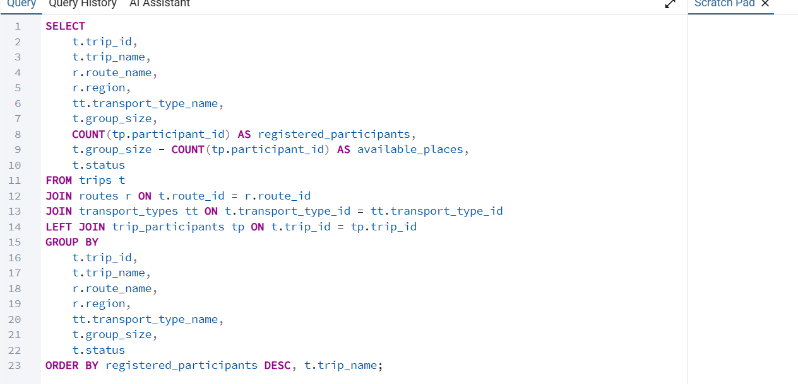

### צילום תוצאה
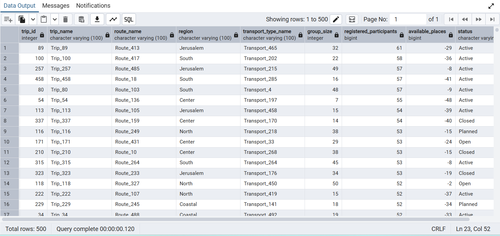

---

## SELECT 1B - סיכום טיולים באמצעות תתי שאילתות

### תיאור
שאילתה זו מציגה את אותו מידע כמו SELECT 1A, אך במקום לבצע JOIN מפורש בין כל הטבלאות, היא משתמשת בתתי שאילתות כדי לשלוף את שם המסלול, האזור, סוג התחבורה וכמות המשתתפים לכל טיול.

### צילום הרצה
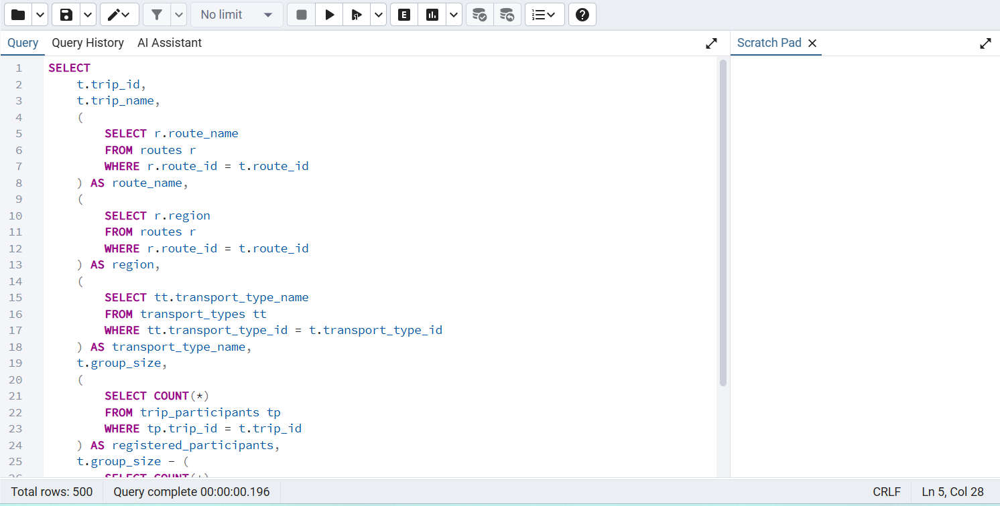

### צילום תוצאה
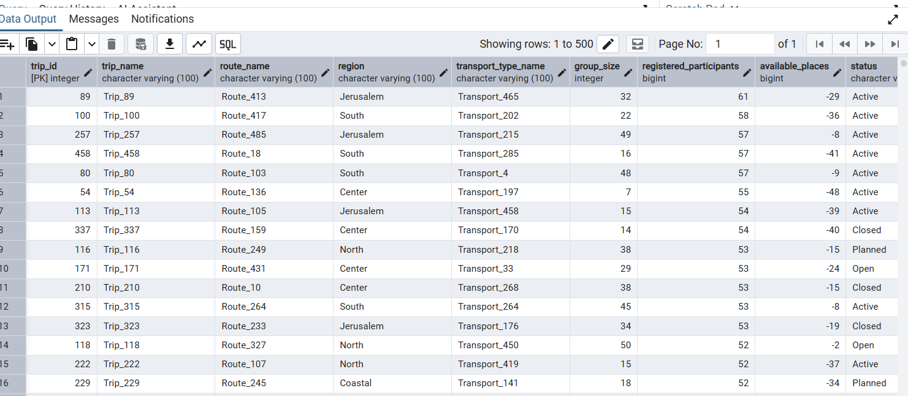

### הסבר יעילות
ב-SELECT 1A נעשה שימוש ב-JOIN וב-GROUP BY, ולכן בסיס הנתונים יכול לבצע חיבור וחישוב בצורה מרוכזת.  
ב-SELECT 1B נעשה שימוש בתתי שאילתות, שחלקן עשויות להתבצע עבור כל שורה בטבלת trips. לכן בדרך כלל SELECT 1A יעילה וברורה יותר כאשר יש כמות גדולה של טיולים ומשתתפים.

---

## SELECT 2A - ניתוח עלויות אירועים לפי טיול וחודש

### תיאור
שאילתה זו מציגה ניתוח עלויות של אירועים לפי טיול ולפי חודש. עבור כל טיול מוצגים השנה והחודש של האירועים, מספר האירועים, העלות הכוללת, העלות הממוצעת, האירוע הזול ביותר והאירוע היקר ביותר.  
השאילתה משתמשת ב-JOIN, GROUP BY ובפירוק תאריך באמצעות EXTRACT.

### צילום הרצה
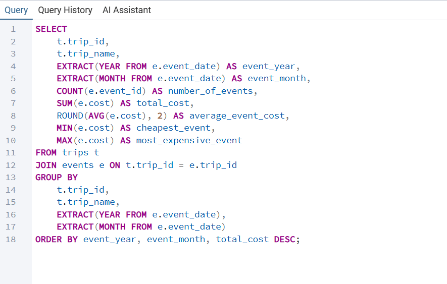

### צילום תוצאה
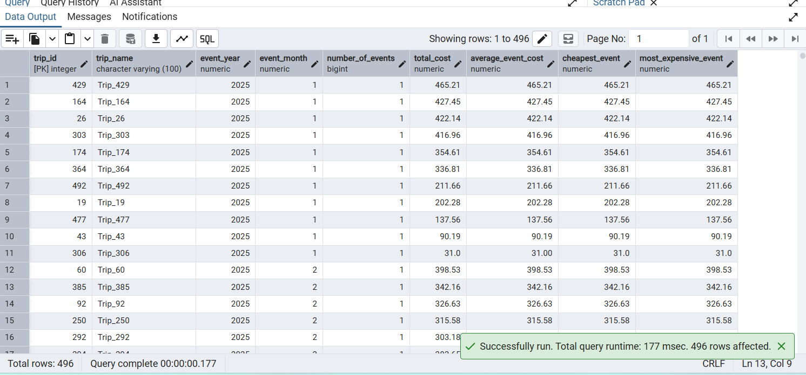

---

## SELECT 2B - ניתוח עלויות אירועים באמצעות תת שאילתה

### תיאור
שאילתה זו מציגה את אותו ניתוח עלויות כמו SELECT 2A, אך קודם מבצעת סיכום פנימי של האירועים לפי טיול, שנה וחודש בתוך תת שאילתה, ורק לאחר מכן מחברת את התוצאה לטבלת trips כדי להציג את שם הטיול.

### צילום הרצה
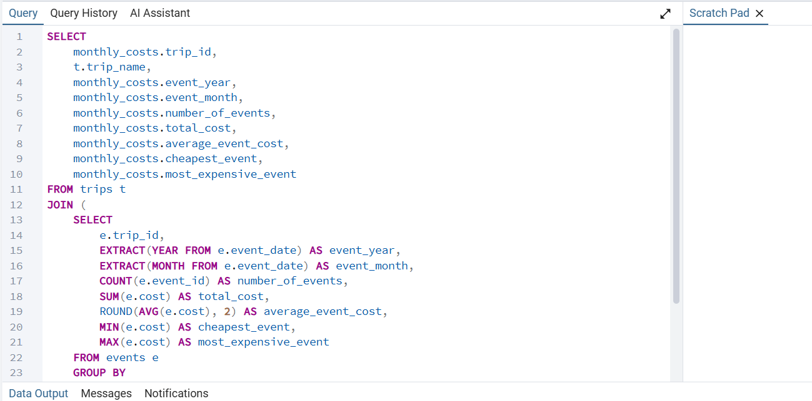

### צילום תוצאה
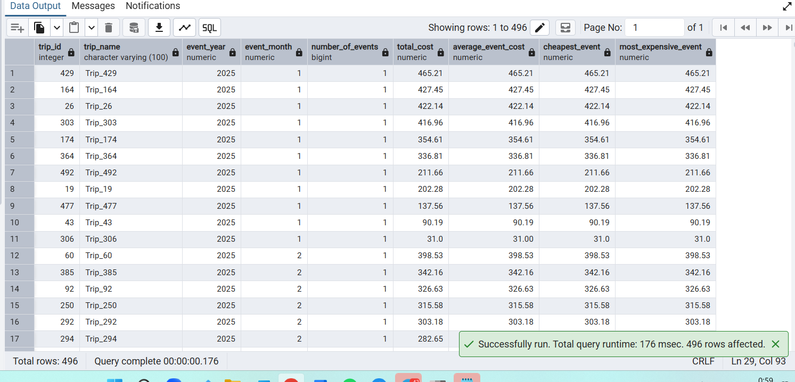

### הסבר יעילות
SELECT 2A מבצעת את החיבור והקיבוץ יחד בשאילתה אחת.  
SELECT 2B קודם מחשבת טבלת ביניים מסוכמת של עלויות האירועים ורק אחר כך מצרפת את שם הטיול. כאשר טבלת האירועים גדולה מאוד, סיכום מוקדם יכול לצמצם את כמות השורות לפני ה-JOIN ולכן עשוי להיות יעיל יותר.

---

## SELECT 3A - מדריכים מנוסים בטיולים קשים

### תיאור
שאילתה זו מציגה מדריכים מנוסים המשתתפים בטיולים מאתגרים. עבור כל מדריך מוצגים פרטיו האישיים, מספר הרישיון, שנות ניסיון, וכן פרטי הטיול והמסלול.  
השאילתה מסננת מדריכים עם לפחות 3 שנות ניסיון ומשייכת אותם לטיולים שבהם רמת הקושי גבוהה או שהמרחק גדול.

### צילום הרצה
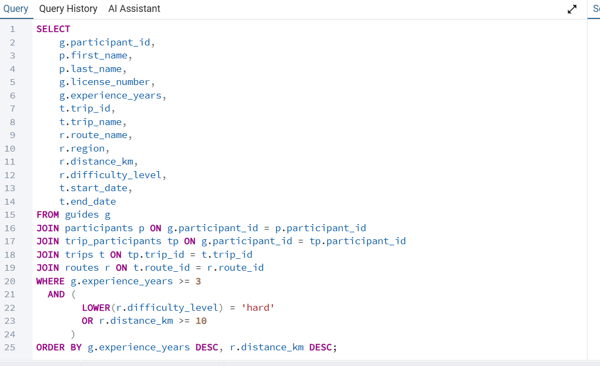

### צילום תוצאה
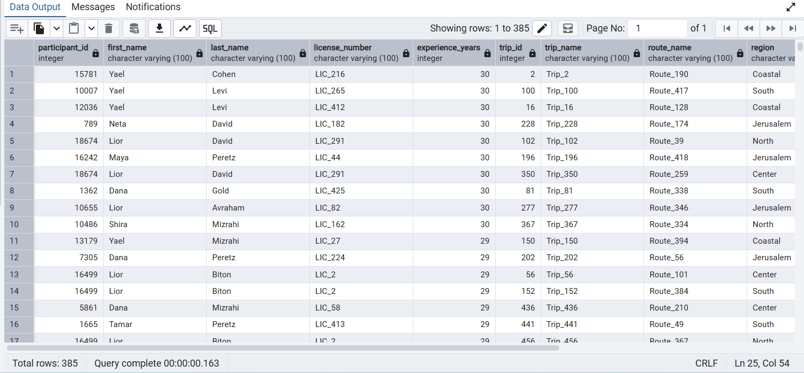

---

## SELECT 3B - מדריכים מנוסים באמצעות EXISTS

### תיאור
שאילתה זו מציגה מדריכים מנוסים שיש להם לפחות טיול אחד מאתגר. השאילתה מציגה את פרטי המדריך בלבד, ומשתמשת ב-EXISTS כדי לבדוק האם קיים עבור המדריך טיול עם מסלול קשה או ארוך.

### צילום הרצה
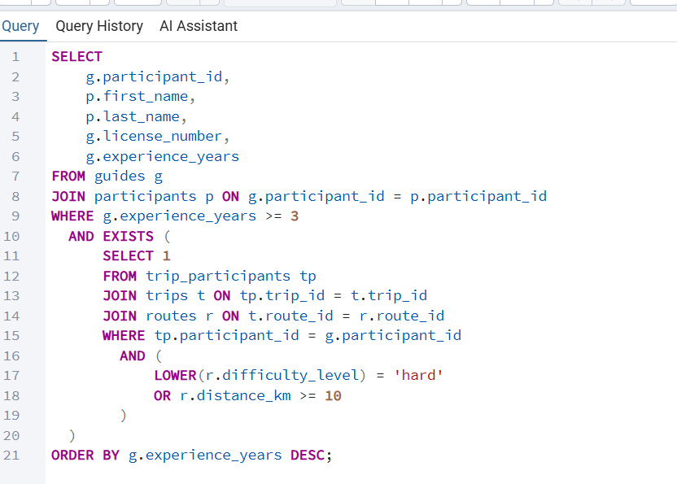

### צילום תוצאה
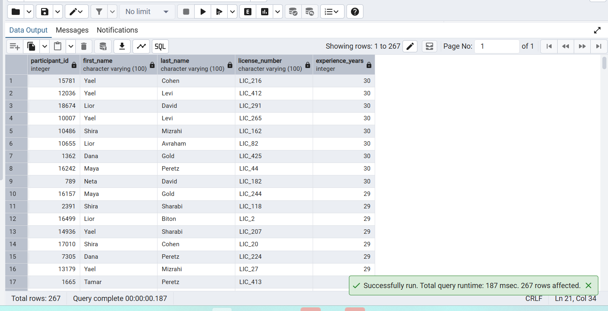

### הסבר יעילות
SELECT 3A משתמשת ב-JOIN ומחזירה גם את פרטי הטיולים והמסלולים, ולכן היא מתאימה כאשר רוצים להציג מידע מלא.  
SELECT 3B משתמשת ב-EXISTS ומתאימה כאשר רוצים רק לבדוק האם קיים למדריך לפחות טיול מאתגר. במקרה כזה EXISTS יכולה להיות יעילה יותר, כי בסיס הנתונים יכול לעצור את החיפוש לאחר שמצא התאמה ראשונה.

---

## SELECT 4A - לו"ז טיולים עם אירועים ופעולות

### תיאור
שאילתה זו מציגה את הלו"ז של הטיולים לפי תאריך ושעה, כולל פרטי הטיול, מספר הסדר בלו"ז, תיאור הפעילות, האירוע המשויך והפעולות הקשורות לאירוע.  
השאילתה משתמשת ב-JOIN וב-LEFT JOIN כדי להציג גם שורות לו"ז שאין להן בהכרח אירוע או פעולה.

### צילום הרצה
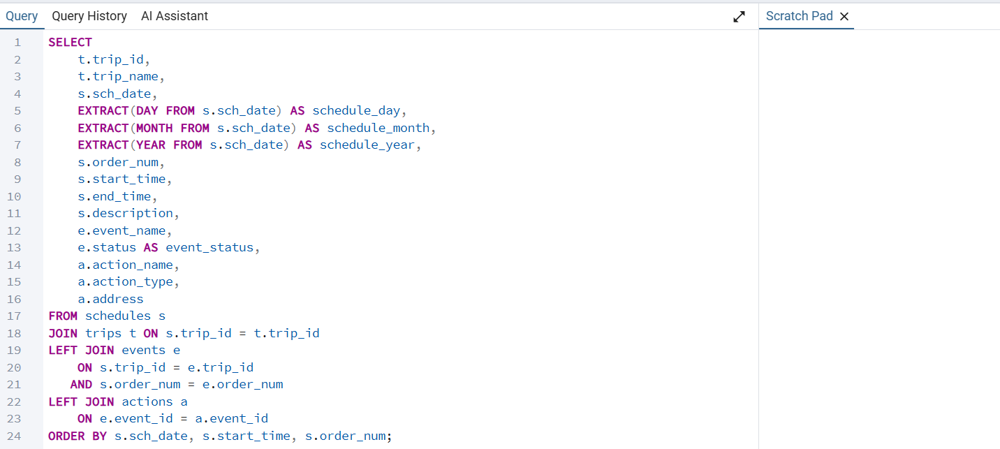

### צילום תוצאה
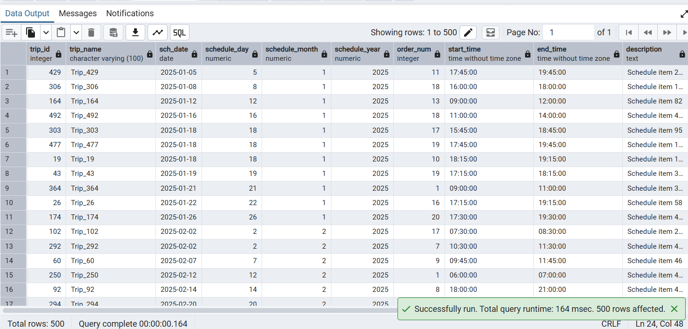

---

## SELECT 4B - שורות לו"ז שיש להן פעולה

### תיאור
שאילתה זו מציגה רק שורות בלו"ז של טיולים שבהן קיימת לפחות פעולה אחת הקשורה לאירוע. כלומר, מוצגים רק חלקים בלו"ז שבהם מתבצעת פעילות בפועל.  
השאילתה משתמשת ב-EXISTS כדי לבדוק קיום של פעולה מתאימה לכל שורת לו"ז.

### צילום הרצה
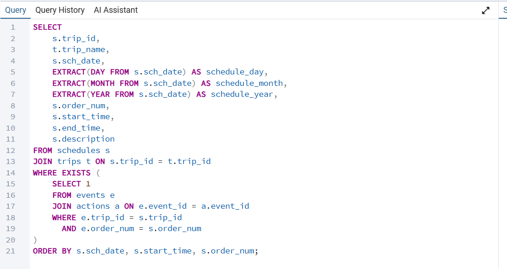

### צילום תוצאה
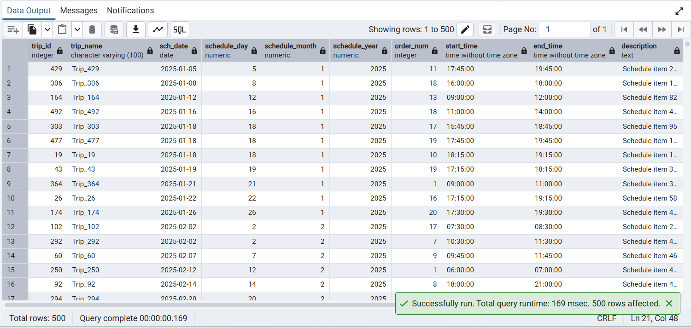

### הסבר יעילות
SELECT 4A מציגה את כל שורות הלו"ז ומצרפת אליהן אירועים ופעולות באמצעות LEFT JOIN, ולכן מחזירה גם שורות ללא פעולות.  
SELECT 4B מסננת מראש רק את השורות שיש להן פעולות באמצעות EXISTS, ולכן מחזירה פחות נתונים. כאשר המטרה היא לבדוק קיום ולא להציג את כל פרטי הפעולות, EXISTS יכולה להיות יעילה יותר.

---

## SELECT 5 - משתתפים שנרשמו ליותר מטיול אחד

### תיאור
שאילתה זו מציגה משתתפים שנרשמו ליותר מטיול אחד. עבור כל משתתף מוצגים פרטיו האישיים, מספר הטיולים אליהם נרשם, תאריך הטיול הראשון ותאריך הטיול האחרון.  
השאילתה משתמשת ב-GROUP BY וב-HAVING כדי לסנן רק משתתפים עם יותר מרישום אחד.

### צילום הרצה
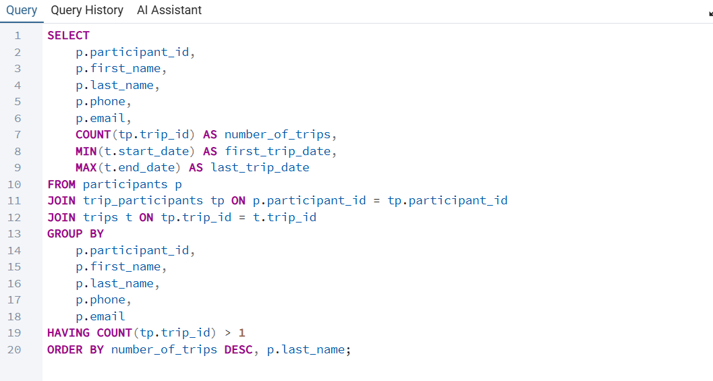

### צילום תוצאה
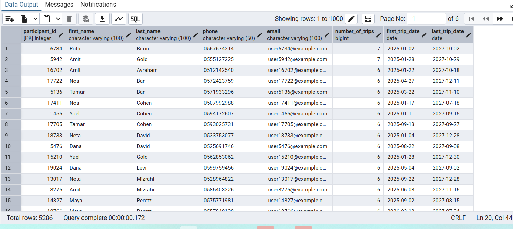

---

## SELECT 6 - מסלולים פופולריים

### תיאור
שאילתה זו מציגה ניתוח פופולריות של מסלולים. עבור כל מסלול מוצגים האזור, המרחק, משך המסלול, רמת הקושי, מספר הטיולים שנעשו במסלול זה, מספר המשתתפים הכולל שנרשמו לטיולים במסלול, וממוצע גודל הקבוצה.  
השאילתה משתמשת ב-JOIN, LEFT JOIN, GROUP BY ופונקציות צבירה כדי להציג מידע מסוכם שאינו מופיע ישירות בטבלה אחת.

### צילום הרצה
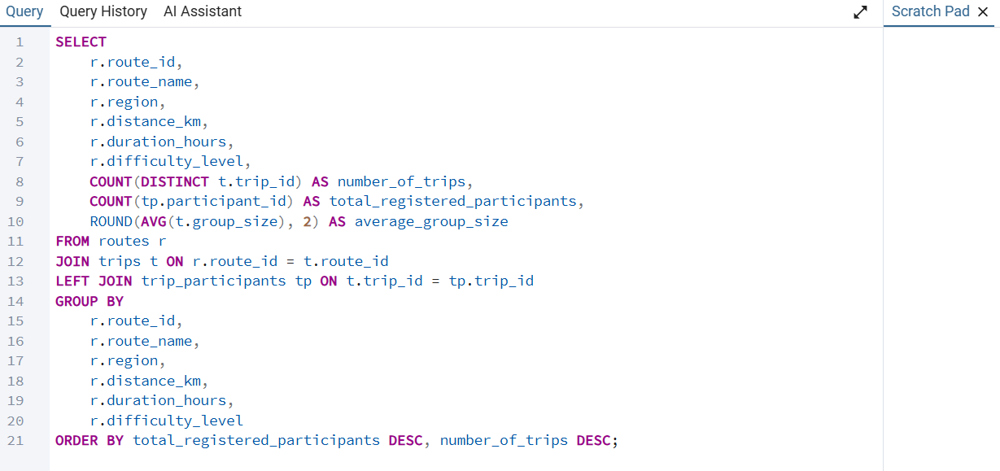

### צילום תוצאה
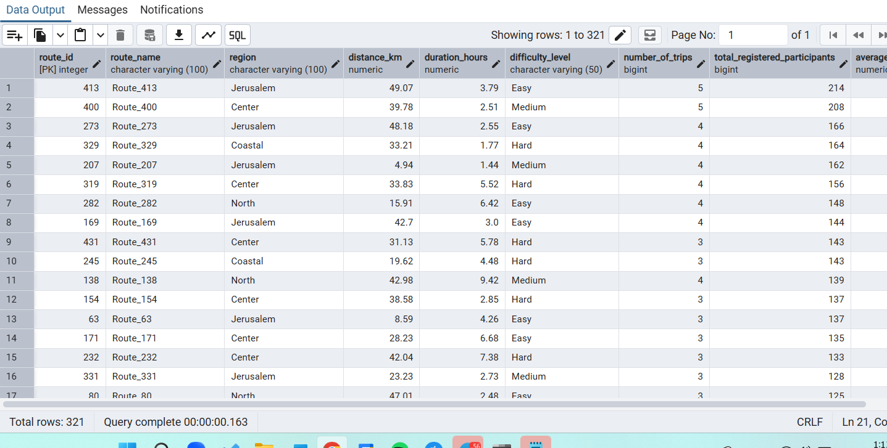

---

## SELECT 7 - טיולים עם מספר משתתפים מעל הממוצע

### תיאור
שאילתה זו מציגה טיולים שמספר המשתתפים הרשומים אליהם גבוה מהממוצע של מספר המשתתפים בטיולים. בנוסף מוצג אחוז התפוסה של כל טיול ביחס לגודל הקבוצה המוגדר.  
השאילתה משתמשת ב-GROUP BY, HAVING ובתת שאילתה מקוננת שמחשבת את ממוצע המשתתפים לכל טיול.

### צילום הרצה
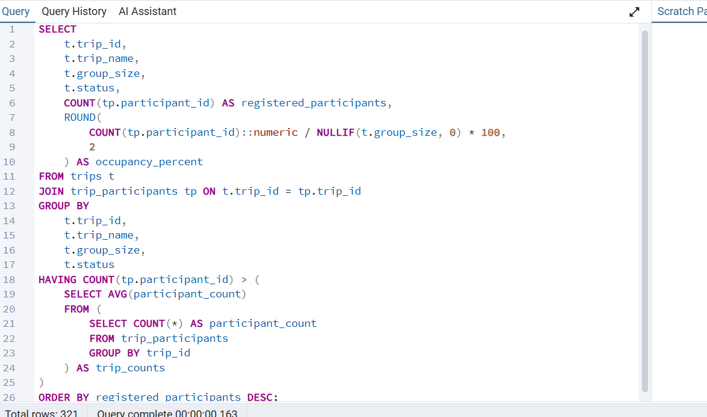

### צילום תוצאה
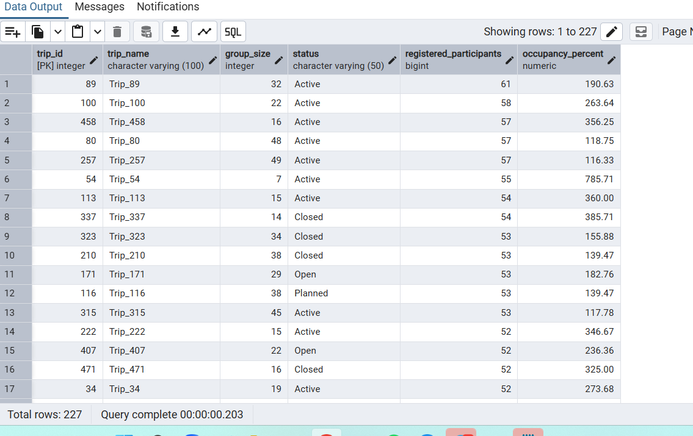

---

## SELECT 8 - ניתוח פעולות לפי סוג פעולה וחודש

### תיאור
שאילתה זו מציגה ניתוח של פעולות לפי סוג פעולה, שנה וחודש. עבור כל סוג פעולה מוצגים מספר הפעולות, מספר האירועים השונים, מספר הטיולים הקשורים והעלות הכוללת של האירועים.  
השאילתה משתמשת ב-JOIN, GROUP BY, פונקציות צבירה ופירוק תאריך באמצעות EXTRACT.

### צילום הרצה
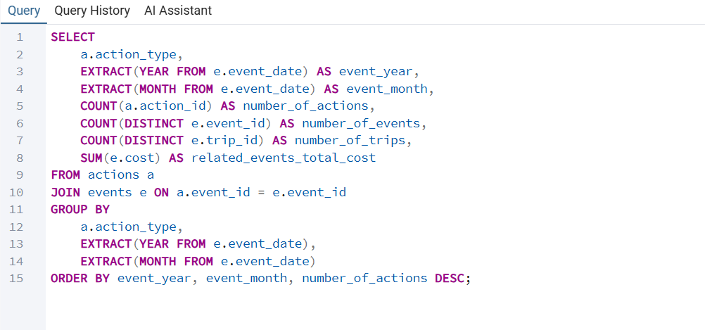

### צילום תוצאה
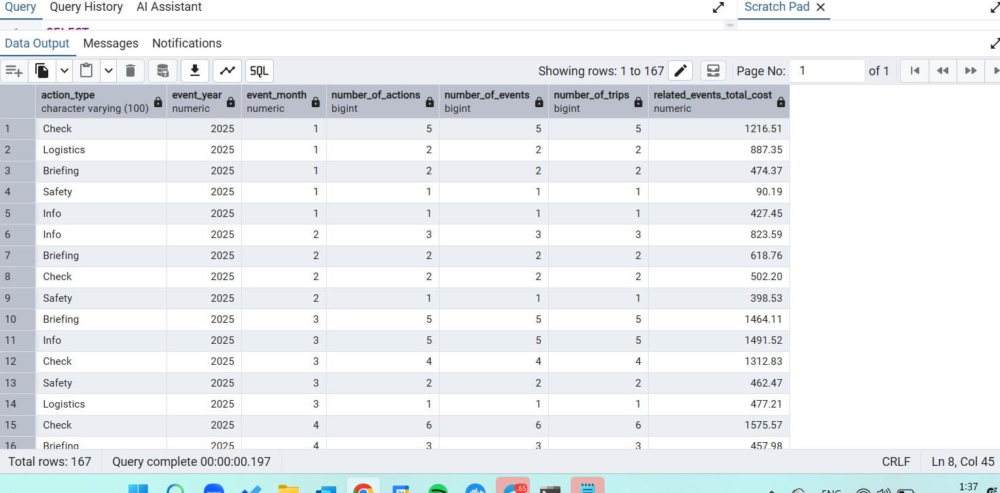

---

# UPDATE Queries

## UPDATE 1 - עדכון סטטוס טיולים שהסתיימו

### תיאור
שאילתת UPDATE זו מעדכנת את סטטוס הטיולים שהסתיימו בעבר ל-completed. בתחילה מוצגים הטיולים שתאריך הסיום שלהם קטן מהתאריך הנוכחי. לאחר ביצוע העדכון ניתן לראות שהסטטוס השתנה ל-completed. לבסוף בוצע ROLLBACK כדי להחזיר את בסיס הנתונים למצבו המקורי.

### צילום לפני
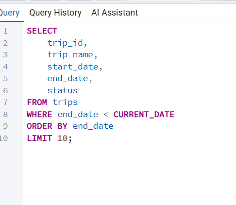

### צילום תוצאה לפני
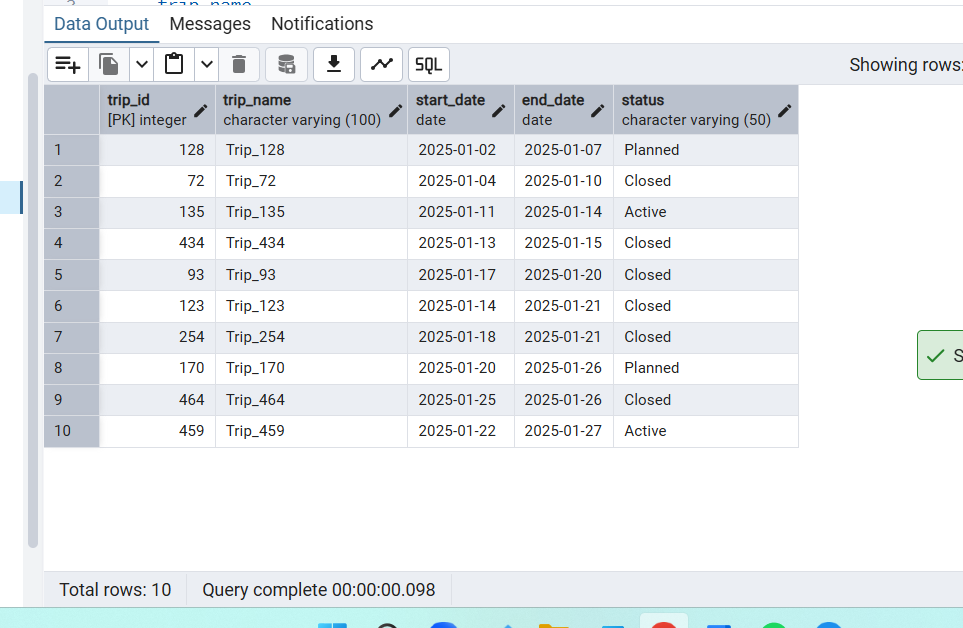

### צילום הרצה
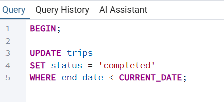

### צילום אחרי
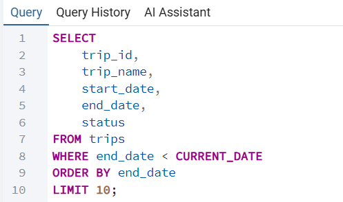

### צילום תוצאה אחרי
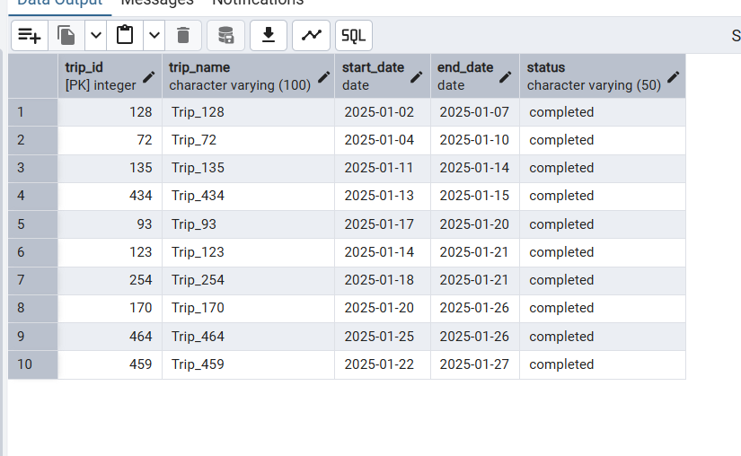

### צילום rollback
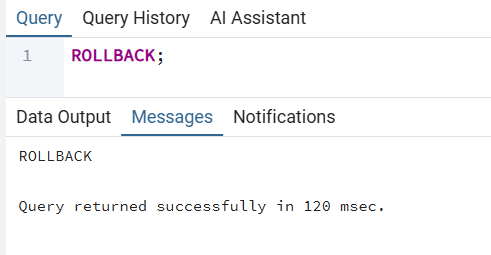

---

## UPDATE 2 - העלאת עלות אירועים עתידיים במסלולים קשים או ארוכים

### תיאור
שאילתת UPDATE זו מעלה ב-10% את העלות של אירועים עתידיים השייכים לטיולים במסלולים קשים או ארוכים. התנאי מתבסס על תאריך האירוע, מרחק המסלול ורמת הקושי שלו. לאחר ההרצה בוצע ROLLBACK כדי לא לשנות את הנתונים לצמיתות.

### צילום לפני
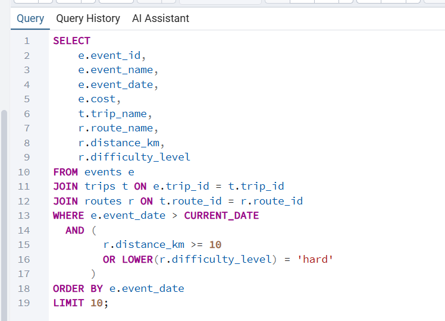

### צילום תוצאה לפני
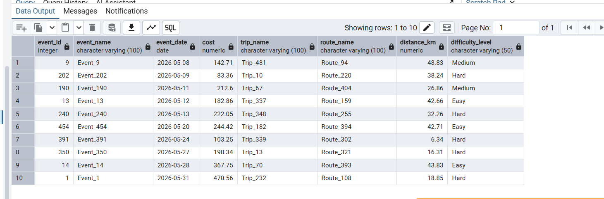

### צילום הרצה
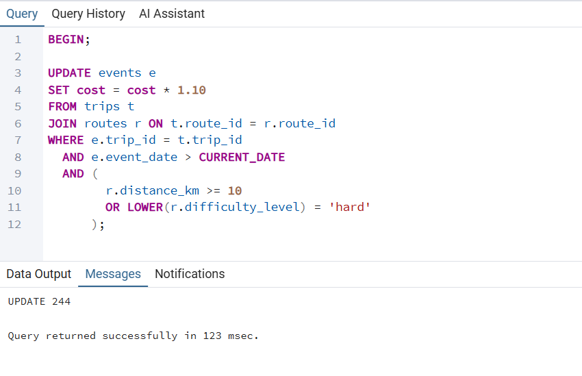

### צילום אחרי
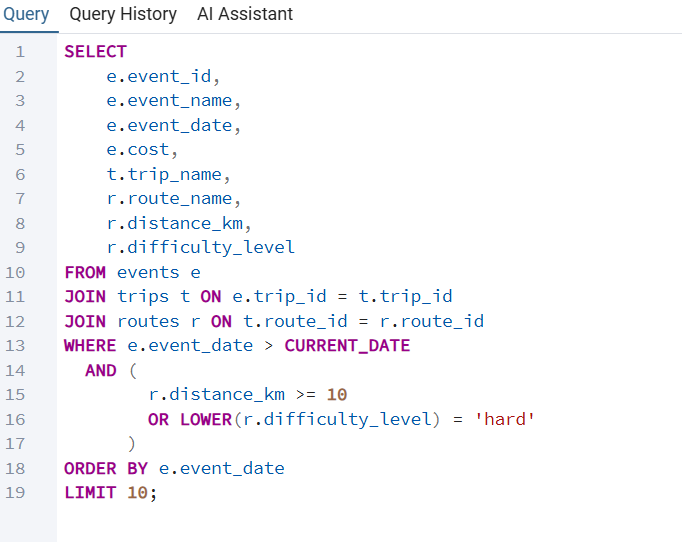

### צילום תוצאה אחרי
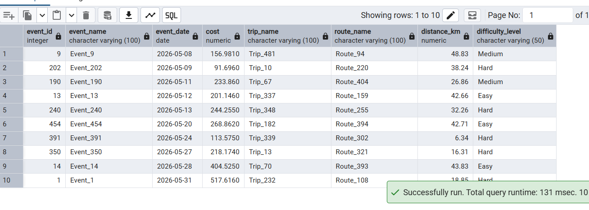

### צילום rollback
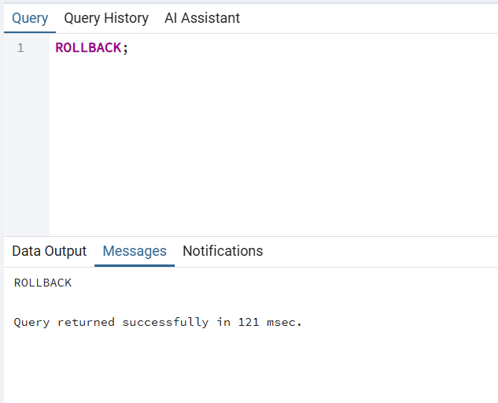

---

## UPDATE 3 - שינוי רמת קושי למסלולים מעל הממוצע

### תיאור
שאילתת UPDATE זו משנה את רמת הקושי של מסלולים שהמרחק שלהם גדול מהממוצע הכללי של כל המסלולים במערכת. לפני העדכון מוצגים המסלולים ורמת הקושי הנוכחית שלהם. לאחר ביצוע העדכון ניתן לראות שרמת הקושי השתנתה ל-Hard עבור המסלולים המתאימים. לבסוף בוצע ROLLBACK כדי להחזיר את בסיס הנתונים למצבו המקורי.

### צילום לפני
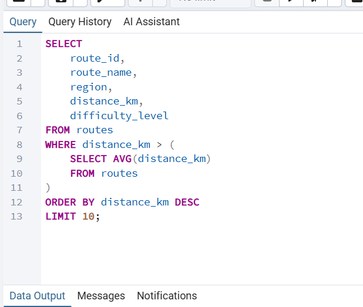

### צילום תוצאה לפני
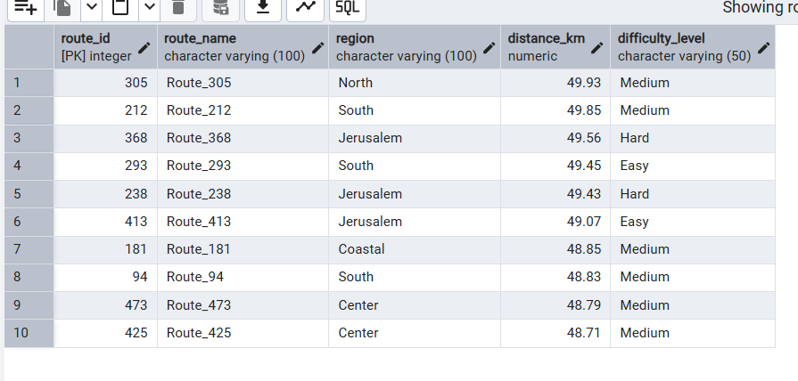

### צילום הרצה
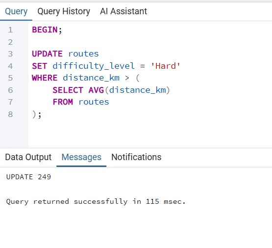

### צילום אחרי
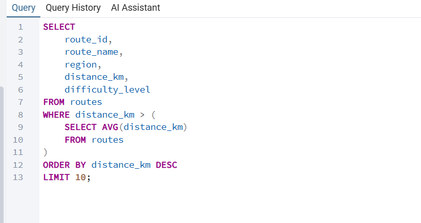

### צילום תוצאה אחרי
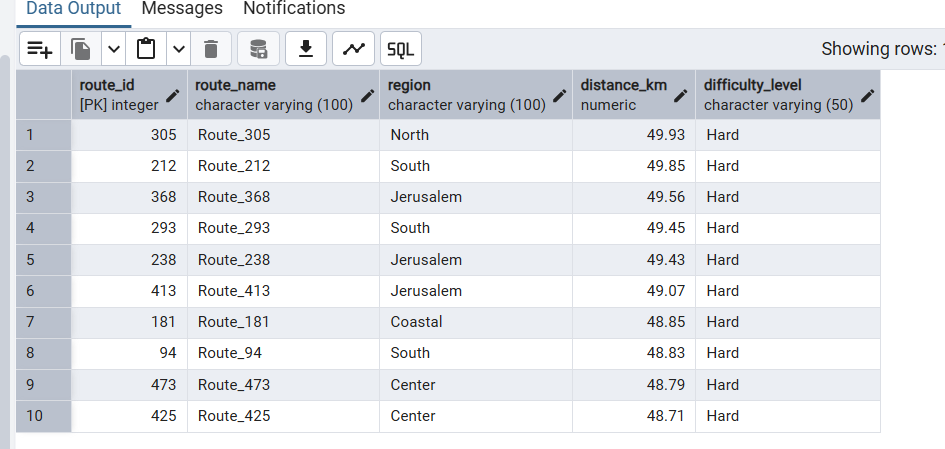

### צילום rollback
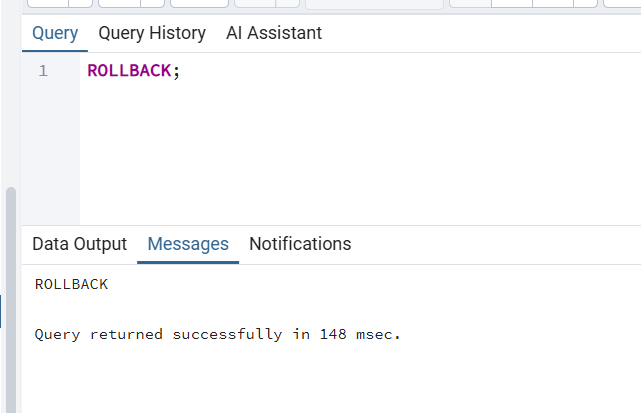

---

# DELETE Queries

## DELETE 1 - מחיקת פעולות מסוג Info

### תיאור
שאילתת DELETE זו מוחקת פעולות מסוג Info מטבלת actions. לפני המחיקה מוצגות הפעולות המתאימות, לאחר מכן מתבצעת המחיקה, ולבסוף ניתן לראות שלא נותרו פעולות מסוג זה. הפעולה בוצעה בתוך טרנזקציה עם ROLLBACK כדי להחזיר את בסיס הנתונים למצבו המקורי.

### צילום לפני
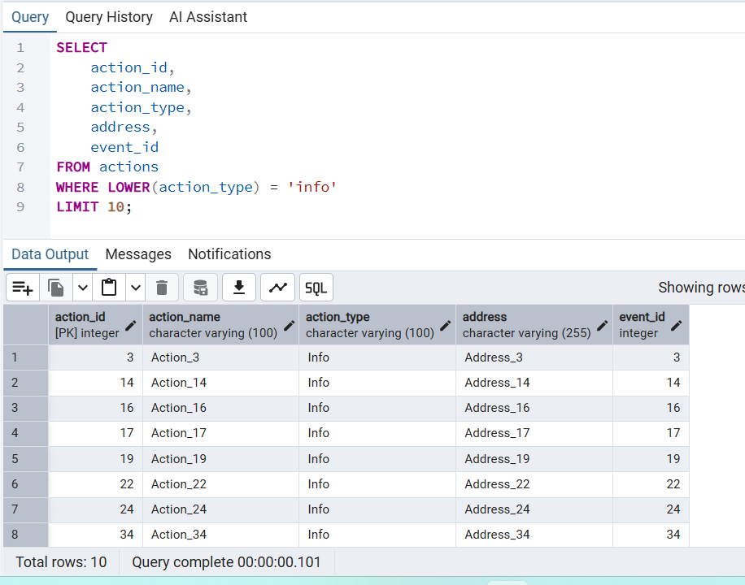

### צילום הרצה
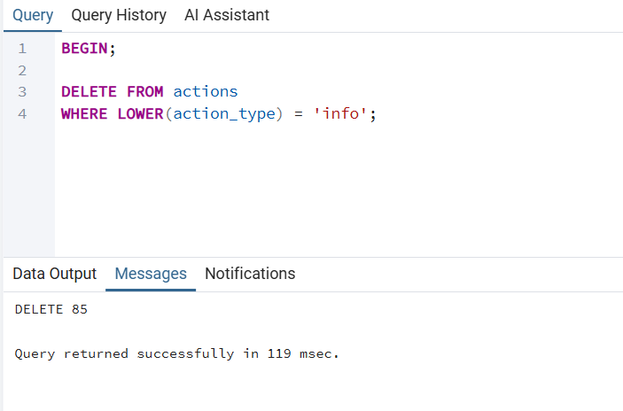

### צילום אחרי
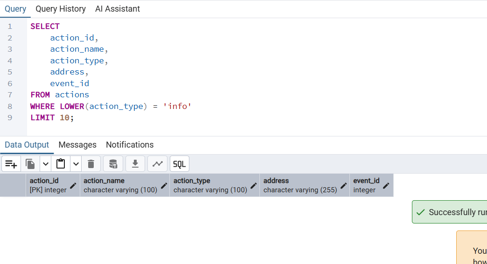

### צילום rollback
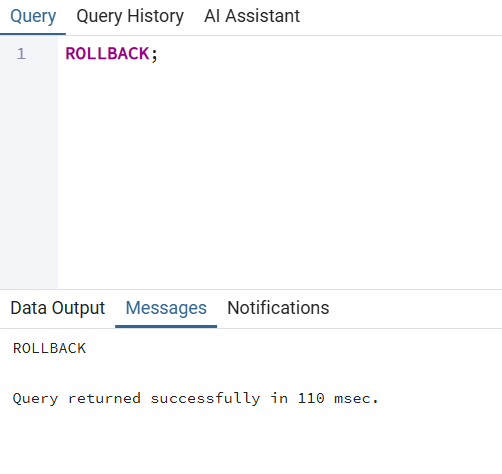

---

## DELETE 2 - מחיקת משתתפים מטיולים שהסתיימו בעבר

### תיאור
שאילתת DELETE זו מוחקת מטבלת trip_participants את המשתתפים המשויכים לטיולים שתאריך הסיום שלהם כבר עבר. לפני המחיקה מוצגים המשתתפים והטיולים הרלוונטיים, לאחר מכן מתבצעת המחיקה, ולבסוף ניתן לראות שהרשומות נמחקו. הפעולה בוצעה בתוך טרנזקציה עם ROLLBACK כדי להחזיר את בסיס הנתונים למצבו המקורי.

### צילום לפני
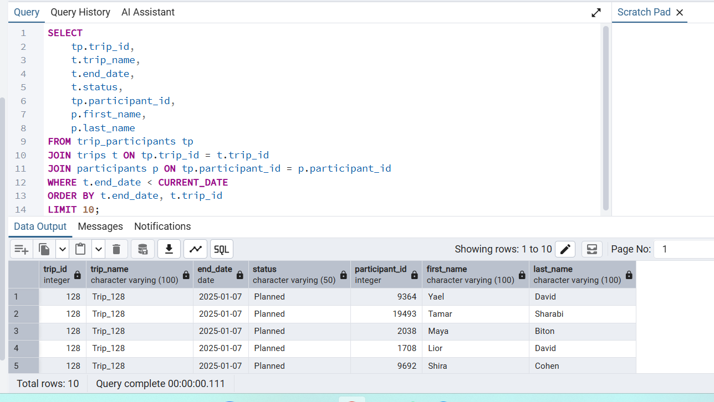

### צילום הרצה
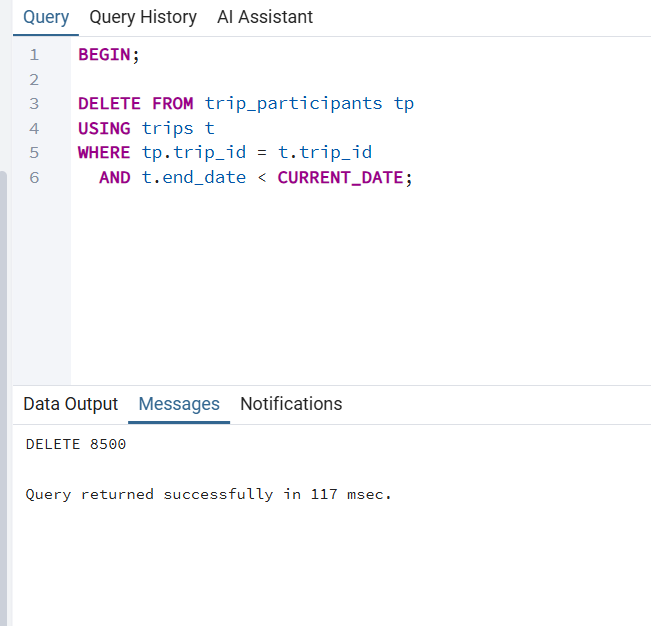

### צילום אחרי
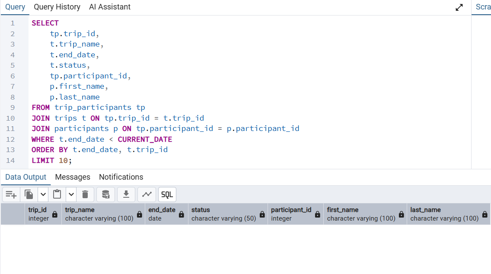

### צילום rollback
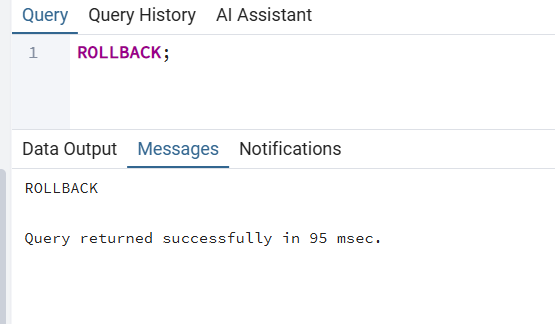

---

## DELETE 3 - מחיקת פעולות המקושרות לאירועים זולים

### תיאור
שאילתת DELETE זו מוחקת פעולות המקושרות לאירועים שעלותם קטנה מ-100. במהלך העבודה התגלתה מגבלת Foreign Key שמנעה מחיקה ישירה של אירועים מטבלת events כל עוד קיימות פעולות בטבלת actions שמצביעות אליהם. לכן המחיקה בוצעה מטבלת actions. פעולה זו מדגימה הבנה של קשרים בין טבלאות ושלמות ייחוסית.

### צילום לפני


### צילום הרצה


### צילום אחרי


### צילום rollback


---


---

# Constraints

## Constraint 1 - Positive Group Size

### תיאור
נוסף אילוץ CHECK לטבלת `trips` שמוודא שגודל הקבוצה (`group_size`) גדול מ־0.  
האילוץ מונע יצירת טיולים עם מספר משתתפים שלילי או אפסי ושומר על תקינות הנתונים במערכת.

### קוד
```sql
ALTER TABLE trips
ADD CONSTRAINT chk_trips_group_size_positive
CHECK (group_size > 0);
```

### צילום הוספת האילוץ


### צילום שגיאה


---

## Constraint 2 - Non Negative Event Cost

### תיאור
נוסף אילוץ CHECK לטבלת `events` שמוודא שהעלות (`cost`) של אירוע אינה שלילית.  
האילוץ שומר על תקינות נתוני העלויות ומונע הכנסת ערכים לא הגיוניים למערכת.

### קוד
```sql
ALTER TABLE events
ADD CONSTRAINT chk_events_cost_non_negative
CHECK (cost >= 0);
```

### צילום הוספת האילוץ


### צילום שגיאה


---

## Constraint 3 - Non Negative Guide Experience

### תיאור
נוסף אילוץ CHECK לטבלת `guides` שמוודא שמספר שנות הניסיון (`experience_years`) של מדריך אינו שלילי.  
האילוץ מונע הכנסת נתונים שגויים או לא הגיוניים עבור מדריכים במערכת.

### קוד
```sql
ALTER TABLE guides
ADD CONSTRAINT chk_guides_experience_years_non_negative
CHECK (experience_years >= 0);
```

### צילום הוספת האילוץ


### צילום שגיאה


---


---

# Rollback And Commit

## Rollback Example

### תיאור
בדוגמה זו בוצע עדכון לסטטוס של טיול בטבלת `trips`.  
לאחר ביצוע העדכון ניתן לראות שהנתון השתנה, אך לאחר ביצוע `ROLLBACK` בסיס הנתונים חזר למצבו המקורי והעדכון בוטל.

### צילום לפני


### צילום ביצוע UPDATE


### צילום אחרי UPDATE


### צילום ביצוע ROLLBACK


### צילום אחרי ROLLBACK


---

## Commit Example

### תיאור
בדוגמה זו בוצע עדכון לרמת הקושי של מסלול בטבלת `routes`.  
לאחר ביצוע `COMMIT` השינוי נשמר באופן קבוע בבסיס הנתונים ולכן גם לאחר סיום הטרנזקציה הנתון נשאר מעודכן.

### צילום לפני


### צילום ביצוע UPDATE


### צילום אחרי UPDATE


### צילום ביצוע COMMIT


### צילום אחרי COMMIT


---