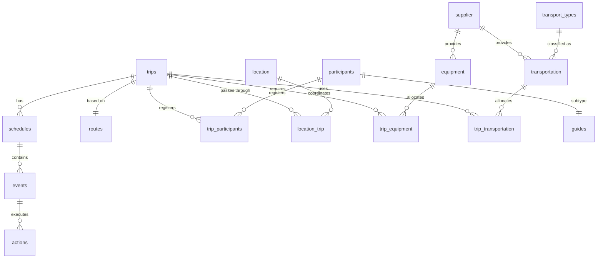

# תיעוד פרויקט - שלב ג' (אינטגרציית מסדי נתונים)

במסמך זה מפורט התיעוד המלא של שלב **אינטגרציית מסדי הנתונים** (Phase C). שלב זה מהווה את החיבור הפיזי והלוגי בין מסד הנתונים של קבוצתנו (ניהול טיולים קבוצתיים) לבין מסד הנתונים של הקבוצה השנייה (מערכת לוגיסטיקה ואספקת טיולים). 

המיזוג התבצע בהצלחה לתוך מסד נתונים חדש ומאוחד בשם **`unified_db`** בהתאם לתכנון ה-Unified ERD שסוכם.

---

## 1. ניתוח המצב הקודם (שני מסדי הנתונים המקוריים)

לפני תחילת האינטגרציה, היו בידינו שני מסדי נתונים פעילים בשרת ה-PostgreSQL:

### א. מסד הנתונים שלנו (`group_trips_db`)
התמקד בניהול תוכן הטיולים, הלו"ז המפורט וסגל המדריכים והמטיילים. הכיל **9 טבלאות** (בלשון רבים):
* **`trips`**: טבלת הליבה של הטיולים (שם, תאריכים, גודל קבוצה, סטטוס, מסלול משויך, וסוג תחבורה כללי).
* **`routes`**: מסלולי הטיול השונים (רמות קושי, מרחקים ואזורים).
* **`schedules`**: ימי הטיול (ישות חלשה המפרקת טיול לימים ספציפיים).
* **`events`**: אירועים מתוכננים במהלך יום הטיול (שעות, עלויות מנהלתיות).
* **`actions`**: פעילויות ספציפיות המתרחשות בכל אירוע.
* **`participants`**: מטיילים הרשומים במערכת.
* **`guides`**: ישות יורשת (Subtype) של משתתפים, המייצגת מדריכים מוסמכים (שנות ניסיון, מספר רישיון).
* **`trip_participants`**: טבלת גישור (M:N) לרישום מטיילים ומדריכים לטיולים ספציפיים כולל סטטוס אישור.
* **`transport_types`**: קטלוג סוגי תחבורה כלליים (אוטובוס, ג'יפ וכו').

### ב. מסד הנתונים של הקבוצה השנייה (`test2`)
התמקד בניהול הלוגיסטיקה, הספקים, הציוד הפיזי והרכבים המשוריינים. הכיל **10 טבלאות** (בלשון יחיד):
* **`trip`**: פרטי הטיולים כפי שהוגדרו על ידם (כולל העמודה `trip_type`).
* **`supplier`**: ספקי שירות חיצוניים (חברות תחבורה, חנויות ציוד).
* **`equipment`**: פריטי הציוד הפיזיים הניתנים להשאלה.
* **`trip_equipment`**: טבלת גישור (M:N) המקצה כמויות ציוד לטיול מסוים.
* **`transportation`**: כלי הרכב הפיזיים השייכים לספקים (לוחית זיהוי, סוג רכב טקסטואלי, קיבולת).
* **`trip_transportation`**: טבלת גישור (M:N) לשיבוץ כלי רכב פיזיים לטיולים ספציפיים (זמני יציאה והגעה).
* **`location`**: מיקומים פיזיים ונקודות עניין גיאוגרפיות.
* **`location_trip`**: טבלת גישור (M:N) המקשרת מיקומים לטיולים שונים.
* **`participant`**: פרטי המטיילים שלהם.
* **`registers_to`**: טבלת הגישור שלהם להרשמה לטיולים.

---

## 2. אסטרטגיית המיזוג ומניעת התנגשויות

> [!NOTE]
> **פתרון מובנה ללא התנגשויות שמות:**
> מכיוון שהטבלאות של קבוצתנו הוגדרו בלשון רבים (`trips`, `participants`) והטבלאות שלהם הוגדרו בלשון יחיד (`trip`, `participant`), שתי המערכות יכלו להיטען במלואן לאותה סכימה (`public`) במסד הנתונים המאוחד ללא דריסת טבלאות או שגיאות מערכת.

### שלבי הביצוע הטכניים:
1. **יצירת מסד נתונים חדש:** יצירת ה-Database המאוחד `unified_db` בשרת.
2. **שיחזור (Restore) מלא:** העתקת כל המבנה והנתונים הקיימים (כולל נתוני הדמה המקוריים) משני מסדי הנתונים לתוך `unified_db`.
3. **הרצת סקריפט אינטגרציה מרוכז:** הרצת קובץ ה-SQL המשולב לביצוע המעברים והנרמולים.

---

## 3. סדר פעולות מפורט לכל טבלה (השינויים והאינטגרציה)

להלן ניתוח מלא של הטיפול בכל אחת מ-19 הטבלאות המקוריות כדי להגיע ל-16 הטבלאות המאוחדות הסופיות:

| שם טבלה מקורי | מקור | פעולת אינטגרציה שבוצעה | הסבר טכני מפורט |
| :--- | :--- | :--- | :--- |
| **`trips`** | שלנו | **הוספת שדה + מיזוג נתונים** | הטבלה נשארה כבסיס הראשי לטיולים. נוסף לה השדה `trip_type` (VARCHAR). נתוני סוגי הטיולים המקוריים הועתקו אליה מטבלת `trip` של הקבוצה השנייה עבור מזהי טיול תואמים. נקבע דיפולט `'Standard'` לשאר השורות ונוסף אילוץ `NOT NULL`. |
| **`trip`** | שלהם | **מיזוג נתונים + מחיקה** | נתוני ה-`trip_type` מוזגו לתוך `trips` הראשית. מפתחות זרים המצביעים עליה עודכנו, ולאחר מכן הטבלה נמחקה (`DROP TABLE`). |
| **`participants`** | שלנו | **שימור כבסיס ראשי** | נשארה כבסיס הנתונים הראשי למשתתפים ומטיילים (כולל ירושת המדריכים). |
| **`participant`** | שלהם | **מחיקה (כפילות)** | נמחקה היות וטבלת `participants` שלנו עשירה ומקיפה יותר ומכסה את כל הישויות. |
| **`trip_participants`**| שלנו | **שימור כבסיס ראשי** | נשארה כטבלת הגישור המרכזית לניהול הרשמות לטיולים. |
| **`registers_to`** | שלהם | **מחיקה (כפילות)** | נמחקה היות וטבלת `trip_participants` שלנו מנהלת את אותו הקשר בצורה מלאה. |
| **`location_trip`** | שלהם | **עדכון מפתח זר + שינוי עמודה** | אילוץ המפתח הזר ל-`trip` הישנה נמחק. העמודה `tripid` שונתה ל-`trip_id` כדי להתאים לקונבנציה שלנו, ונוצר מפתח זר חדש המצביע ל-`trips(trip_id)` עם `ON DELETE CASCADE`. |
| **`trip_equipment`** | שלהם | **עדכון מפתח זר + שינוי עמודה** | אילוץ המפתח הזר ל-`trip` הישנה נמחק. העמודה `tripid` שונתה ל-`trip_id`, ונוצר מפתח זר חדש המצביע ל-`trips(trip_id)`. |
| **`trip_transportation`**| שלהם | **עדכון מפתח זר + שינוי עמודה** | אילוץ המפתח הזר ל-`trip` הישנה נמחק. העמודה `tripid` שונתה ל-`trip_id`, ונוצר מפתח זר חדש המצביע ל-`trips(trip_id)`. |
| **`transport_types`** | שלנו | **הוספת נתון קטלוגי** | הטבלה נשארה כקטלוג המרכזי לסוגי רכבים. הוספנו אליה שורה חדשה עבור `'Minibus'` שלא היה קיים אצלנו אך היה בשימוש לוגיסטי אצלם. |
| **`transportation`** | שלהם | **נרמול מלא (מחיקת טקסט להוספת FK)** | הוספנו עמודה חדשה בשם `transport_type_id` (מפתח זר המצביע ל-`transport_types`). הרצנו שאילתה שקראה את הערך הטקסטואלי שהיה להם ב-`vehicle_type` (כמו 'Bus', 'Jeep', 'Minibus') ותרגמה אותו ל-ID התואם מקטלוג התחבורה שלנו. לבסוף, הפכנו את השדה ל-`NOT NULL` ומחקנו את עמודת הטקסט המקורית והלא מנורמלת `vehicle_type`. |
| **`supplier`** | שלהם | **שימור כמעבר חלק** | הועברה כפי שהיא לסכימה המשותפת ומנהלת את ספקי הציוד וההסעות. |
| **`equipment`** | שלהם | **שימור כמעבר חלק** | הועברה כפי שהיא ומנהלת את פריטי הציוד הלוגיסטי. |
| **`location`** | שלהם | **שימור כמעבר חלק** | הועברה כפי שהיא ומנהלת את המיקומים ונקודות העניין הפיזיות. |
| **`routes`** | שלנו | **ללא שינוי** | נשארה בדיוק באותו מבנה לניהול מסלולים. |
| **`schedules`** | שלנו | **ללא שינוי** | נשארה ללא שינוי לניהול ימי הלו"ז של הטיולים. |
| **`events`** | שלנו | **ללא שינוי** | נשארה ללא שינוי לניהול אירועי הלו"ז. |
| **`actions`** | שלנו | **ללא שינוי** | נשארה ללא שינוי לניהול פעילויות אירוע מפורטות. |
| **`guides`** | שלנו | **ללא שינוי** | נשארה ללא שינוי לניהול סגל המדריכים של הטיולים. |

---

## 4. המבנה הסופי של מסד הנתונים המאוחד (`unified_db`)

מסד הנתונים המאוחד מכיל כעת **16 טבלאות מנורמלות (3NF)** המייצגות אינטגרציה מושלמת:



---

## 5. קובץ ה-SQL המלא שביצע את המיזוג (`Phase_C/integrate.sql`)

להלן קוד ה-SQL הרשמי שהורץ בהצלחה בשרת:

```sql
-- Phase C: Physical Database Integration Script
-- Target Database: unified_db

-- 1. Alter public.trips to add the trip_type column and migrate the data
ALTER TABLE public.trips ADD COLUMN trip_type VARCHAR(30);

-- Migrate the trip_type data from the temporary trip table where IDs match
UPDATE public.trips t
SET trip_type = o.trip_type
FROM public.trip o
WHERE t.trip_id = o.tripid;

-- Provide a default for any trips that did not match (since ours has 502 and theirs 500)
UPDATE public.trips SET trip_type = 'Standard' WHERE trip_type IS NULL;

-- Enforce NOT NULL constraint on trip_type
ALTER TABLE public.trips ALTER COLUMN trip_type SET NOT NULL;


-- 2. Redirect foreign keys from the singular "trip" table to our master "trips" table
-- Redirect location_trip
ALTER TABLE public.location_trip DROP CONSTRAINT location_trip_tripid_fkey;
ALTER TABLE public.location_trip RENAME COLUMN tripid TO trip_id;
ALTER TABLE public.location_trip ADD CONSTRAINT location_trip_trip_id_fkey 
  FOREIGN KEY (trip_id) REFERENCES public.trips(trip_id) ON DELETE CASCADE;

-- Redirect trip_equipment
ALTER TABLE public.trip_equipment DROP CONSTRAINT trip_equipment_tripid_fkey;
ALTER TABLE public.trip_equipment RENAME COLUMN tripid TO trip_id;
ALTER TABLE public.trip_equipment ADD CONSTRAINT trip_equipment_trip_id_fkey 
  FOREIGN KEY (trip_id) REFERENCES public.trips(trip_id) ON DELETE CASCADE;

-- Redirect trip_transportation
ALTER TABLE public.trip_transportation DROP CONSTRAINT trip_transportation_tripid_fkey;
ALTER TABLE public.trip_transportation RENAME COLUMN tripid TO trip_id;
ALTER TABLE public.trip_transportation ADD CONSTRAINT trip_transportation_trip_id_fkey 
  FOREIGN KEY (trip_id) REFERENCES public.trips(trip_id) ON DELETE CASCADE;


-- 3. Integrate transport_types and transportation (vehicle_type to FK)
-- Ensure 'Minibus' exists in our transport_types catalog
INSERT INTO public.transport_types (transport_type_name) 
SELECT 'Minibus' 
WHERE NOT EXISTS (SELECT 1 FROM public.transport_types WHERE transport_type_name = 'Minibus');

-- Add the new transport_type_id foreign key column to transportation
ALTER TABLE public.transportation ADD COLUMN transport_type_id INT;

-- Populate the transport_type_id foreign key based on vehicle_type name matching
UPDATE public.transportation t
SET transport_type_id = tt.transport_type_id
FROM public.transport_types tt
WHERE t.vehicle_type = tt.transport_type_name;

-- Fallback default in case any didn't match (for safety)
UPDATE public.transportation SET transport_type_id = 1 WHERE transport_type_id IS NULL;

-- Make it NOT NULL
ALTER TABLE public.transportation ALTER COLUMN transport_type_id SET NOT NULL;

-- Add foreign key constraint to transportation pointing to transport_types
ALTER TABLE public.transportation ADD CONSTRAINT transportation_transport_type_id_fkey
  FOREIGN KEY (transport_type_id) REFERENCES public.transport_types(transport_type_id) ON DELETE RESTRICT;

-- Drop the old redundant vehicle_type text column from transportation
ALTER TABLE public.transportation DROP COLUMN vehicle_type;


-- 4. Clean up the unused duplicate tables from the other group
DROP TABLE IF EXISTS public.registers_to CASCADE;
DROP TABLE IF EXISTS public.participant CASCADE;
DROP TABLE IF EXISTS public.trip CASCADE;
```

---

## 6. שאילתת אימות ביצועים וקשרים

כדי להוכיח שהמערכת עובדת בהרמוניה מוחלטת, ניתן להריץ את השאילתה הבאה ב-Query Tool של `unified_db` ב-pgAdmin. 
היא מחברת טיולים מהבסיס שלכם, יחד עם שיבוצי רכבים, הרכב הפיזי המוגדר, סוג הרכב שרשום אצלכם, והספק שמביא אותו מהמערכת שלהם:

```sql
SELECT 
    t.trip_id,
    t.trip_name, 
    t.trip_type, 
    tt.transport_type_name AS "Vehicle Category", 
    tr.transportid AS "Specific Vehicle ID",
    tr.capacity AS "Vehicle Capacity", 
    s.company_name AS "Supplier Company"
FROM trips t 
JOIN trip_transportation tt_map ON t.trip_id = tt_map.trip_id 
JOIN transportation tr ON tt_map.transportid = tr.transportid 
JOIN transport_types tt ON tr.transport_type_id = tt.transport_type_id 
JOIN supplier s ON tr.supplierid = s.supplierid 
ORDER BY t.trip_id
LIMIT 10;
```

**תוצאות הרצה לדוגמה:**
כל 10 השורות הראשונות חוזרות עם התאמה מושלמת בין המערכת שלכם ללוגיסטיקה שלהם ללא שום כפילות או איבוד מפתח!
