# שלב ד – תכנות PL/pgSQL

## מערכת ניהול טיולים קבוצתיים – בסיס נתונים משולב

בשלב זה נכתבו תוכניות PL/pgSQL על בסיס הנתונים המשולב שנוצר בשלב ג'.  
המטרה הייתה להוסיף לוגיקה תכנותית לבסיס הנתונים: פונקציות, פרוצדורות, טריגרים ותוכניות ראשיות שמריצות אותן.

השלב כולל:

- 2 פונקציות
- 2 פרוצדורות
- 2 טריגרים, כאשר לפחות אחד מהם מופעל בזמן `UPDATE`
- 2 תוכניות ראשיות, שכל אחת מפעילה פונקציה אחת ופרוצדורה אחת
- קובץ `AlterTable.sql` להוספת טבלאות עזר ללוגים
- צילומי מסך שמוכיחים שכל תוכנית רצה ועובדת

---

## מבנה התיקייה

בתיקיית `Phase_D` נמצאים הקבצים הבאים:

```text
Phase_D/
│
├── AlterTable.sql
├── Function_1_TripOccupancySummary.sql
├── Function_2_LogisticsCursor.sql
├── Procedure_1_UpdateTripStatusByOccupancy.sql
├── Procedure_2_AllocateEquipmentToTrip.sql
├── Trigger_1_TripStatusLog.sql
├── Trigger_2_EquipmentStockLog.sql
├── Main_1_TripOccupancy.sql
├── Main_2_LogisticsEquipment.sql
│
└── img/
    ├── alter-table-success.png
    ├── func1-create.png
    ├── func1-run-success.png
    ├── func1-run-suc-overbook.png
    ├── func1-run-err.png
    ├── func2-run-success-ref cursor.png
    ├── func2-run-success-data.png
    ├── func2-run-success-commit.png
    ├── procedure1-beforerun.png
    ├── procedure1-run-success.png
    ├── procedure1-afterrun.png
    ├── procedure2-search equipment.png
    ├── procedure2-before.png
    ├── procedure2-successrun.png
    ├── procedure2-after.png
    ├── procedure2-exception.png
    ├── trigger1-empty-log.png
    ├── trigger1-activate-status change.png
    ├── trigger1-result.png
    ├── trigger2-before.png
    ├── trigger2-activate-stock change.png
    ├── trigger2-after.png
    ├── main1-success.png
    ├── main2-p1-cursor.png
    ├── main2-p2-fetch.png
    ├── main2-p3-commit.png
    └── main2-p4.png
```

> הערה: אם במחשב שם תמונה מעט שונה בגלל רווחים או ירידת שורה בשם, יש לעדכן את שם הקובץ בקישור לתמונה בהתאם לשם האמיתי בתיקייה.

---

## סדר הרצה מומלץ

יש להריץ את הקבצים ב־pgAdmin על בסיס הנתונים המשולב, לפי הסדר הבא:

```text
1. AlterTable.sql
2. Function_1_TripOccupancySummary.sql
3. Function_2_LogisticsCursor.sql
4. Procedure_1_UpdateTripStatusByOccupancy.sql
5. Procedure_2_AllocateEquipmentToTrip.sql
6. Trigger_1_TripStatusLog.sql
7. Trigger_2_EquipmentStockLog.sql
8. Main_1_TripOccupancy.sql
9. Main_2_LogisticsEquipment.sql
```

הסיבה לסדר הזה היא שיש תלות בין הקבצים:

- הטריגרים משתמשים בטבלאות הלוג שנוצרות ב־`AlterTable.sql`.
- התוכניות הראשיות משתמשות בפונקציות ובפרוצדורות, ולכן צריך ליצור אותן קודם.
- הפרוצדורה השנייה מעדכנת מלאי ציוד, ולכן טריגר המלאי יכול להיכנס לפעולה לאחר יצירתו.

---

# 1. AlterTable.sql

## תפקיד הקובץ

הקובץ מוסיף שתי טבלאות לוג למערכת:

```text
trip_status_log
 equipment_stock_log
```

### `trip_status_log`

טבלה זו שומרת היסטוריה של שינויי סטטוס בטיולים.  
כאשר סטטוס של טיול משתנה, הטריגר הראשון מוסיף אליה רשומה.

שדות עיקריים:

- `log_id` – מזהה רשומת לוג
- `trip_id` – מזהה הטיול
- `old_status` – הסטטוס הקודם
- `new_status` – הסטטוס החדש
- `changed_at` – זמן השינוי
- `changed_by` – המשתמש שביצע את השינוי

### `equipment_stock_log`

טבלה זו שומרת היסטוריה של שינויי מלאי ציוד.  
כאשר `totalinstock` בטבלת `equipment` משתנה, הטריגר השני מוסיף אליה רשומה.

שדות עיקריים:

- `log_id` – מזהה רשומת לוג
- `equipmentid` – מזהה הציוד
- `old_totalinstock` – מלאי קודם
- `new_totalinstock` – מלאי חדש
- `quantity_changed` – בכמה השתנה המלאי
- `changed_at` – זמן השינוי
- `changed_by` – המשתמש שביצע את השינוי

## איך מריצים

ב־pgAdmin:

1. פותחים את בסיס הנתונים המשולב.
2. פותחים Query Tool.
3. מדביקים או פותחים את `AlterTable.sql`.
4. לוחצים Execute.

## בדיקת הצלחה

```sql
SELECT table_name
FROM information_schema.tables
WHERE table_schema = 'public'
  AND table_name IN ('trip_status_log', 'equipment_stock_log')
ORDER BY table_name;
```

## צילום מסך

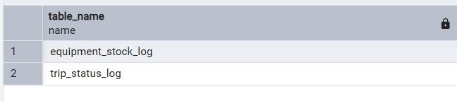

---

# 2. Function_1_TripOccupancySummary.sql

## שם הפונקציה

```sql
public.get_trip_occupancy_summary(p_trip_id INT)
```

## תיאור מילולי

הפונקציה מקבלת מזהה טיול ומחזירה סיכום תפוסה של אותו טיול.

הפונקציה בודקת:

- האם הטיול קיים
- מה גודל הקבוצה המותר
- כמה משתתפים רשומים בפועל
- כמה מקומות פנויים נשארו
- מה אחוז התפוסה
- מה הסטטוס הנוכחי
- מה הסטטוס המומלץ לפי מצב התפוסה

הסטטוסים האפשריים שהפונקציה מחזירה:

```text
AVAILABLE  – יש עדיין מקומות פנויים
FULL       – מספר המשתתפים שווה בדיוק לגודל הקבוצה
OVERBOOKED – רשומים יותר משתתפים מהמותר
```

## אלמנטים תכנותיים

הפונקציה כוללת:

- `RECORD`
- `SELECT INTO`
- `IF / ELSIF / ELSE`
- `RETURN QUERY`
- `EXCEPTION`
- חישוב כמות משתתפים ואחוז תפוסה

## הרצה לדוגמה

```sql
SELECT *
FROM public.get_trip_occupancy_summary(1);
```

## בדיקת חריגה

```sql
SELECT *
FROM public.get_trip_occupancy_summary(-999);
```

במקרה כזה אמורה להתקבל חריגה, כי אין טיול עם מזהה כזה.

## צילומי מסך

יצירת הפונקציה:

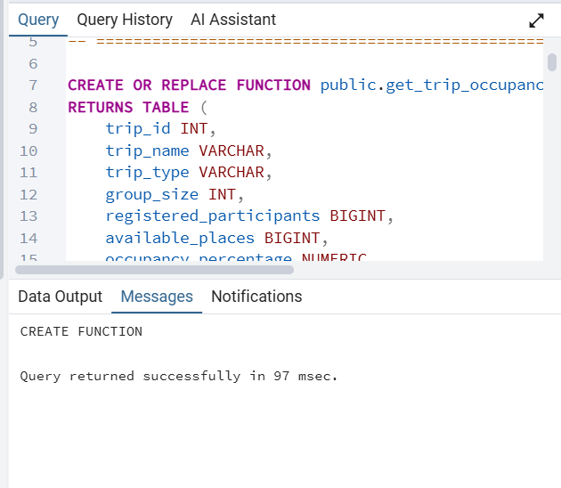

הרצה תקינה:

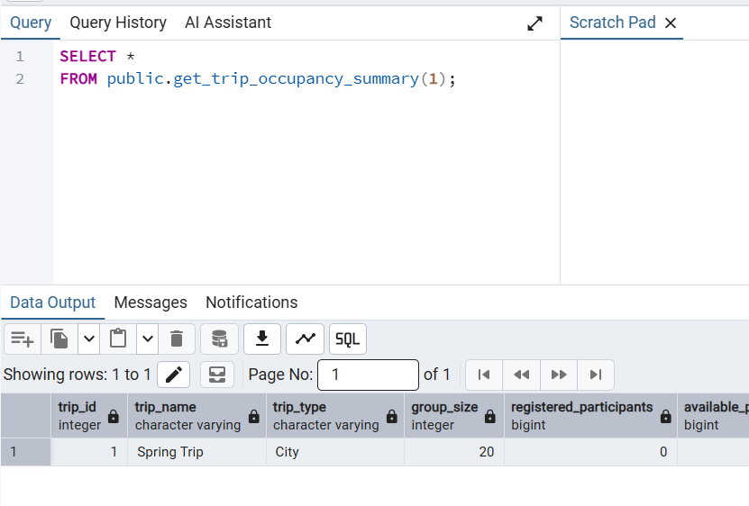

הרצה שמחזירה מצב `OVERBOOKED`:

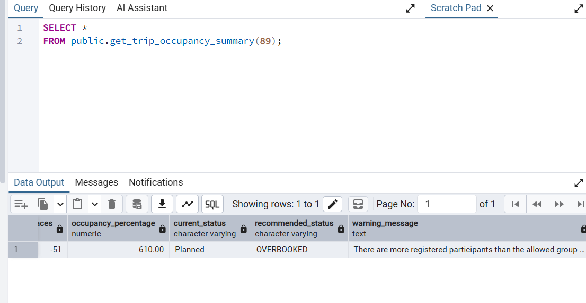

בדיקת חריגה:

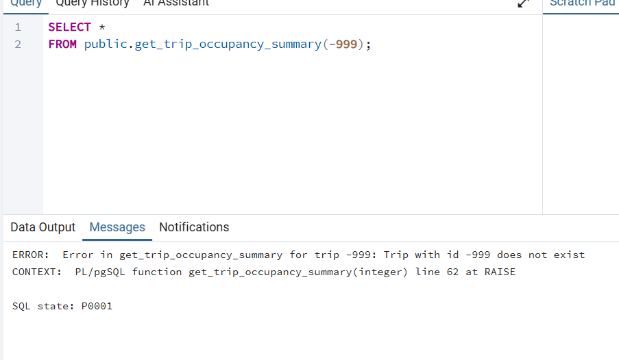

---

# 3. Function_2_LogisticsCursor.sql

## שם הפונקציה

```sql
public.get_logistics_by_region_cursor(p_region VARCHAR)
```

## תיאור מילולי

פונקציה זו מקבלת אזור, למשל `North` או `South`, ומחזירה `REFCURSOR` עם מידע לוגיסטי על הטיולים באותו אזור.

המידע שמוחזר כולל:

- פרטי טיול
- סוג טיול
- תאריכי התחלה וסיום
- נקודות מיקום
- כתובת ואזור
- רכב משויך
- סוג רכב
- קיבולת רכב
- ספק תחבורה
- ציוד משויך
- כמות ציוד
- ספק ציוד

## למה משתמשים ב־Ref Cursor

`REFCURSOR` מאפשר לפתוח תוצאה מורכבת ולשלוף אותה אחר כך באמצעות `FETCH`.  
זה שימושי כאשר רוצים להחזיר תוצאה גדולה או מורכבת מתוך פונקציה.

## אלמנטים תכנותיים

הפונקציה כוללת:

- `REFCURSOR`
- פתיחת cursor עם `OPEN ... FOR`
- `JOIN` בין טבלאות רבות
- `RETURN`
- `EXCEPTION`

## איך מריצים

חשוב להריץ Cursor בתוך טרנזקציה:

```sql
BEGIN;

SELECT public.get_logistics_by_region_cursor('North');

FETCH ALL FROM logistics_cursor;

COMMIT;
```

אם הייתה שגיאה באמצע הטרנזקציה, יש להריץ:

```sql
ROLLBACK;
```

ורק אז להתחיל מחדש.

## צילומי מסך

החזרת שם ה־cursor:


שליפת הנתונים מתוך ה־cursor:

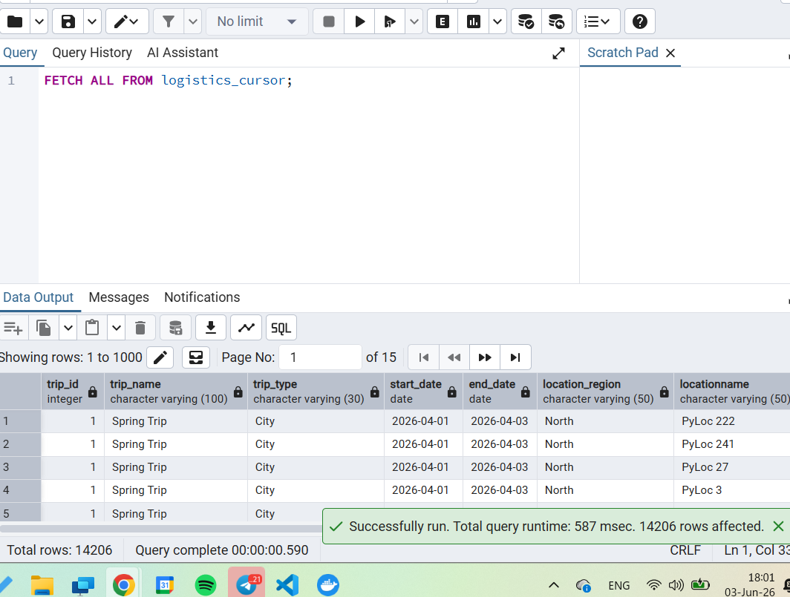

סיום הטרנזקציה:

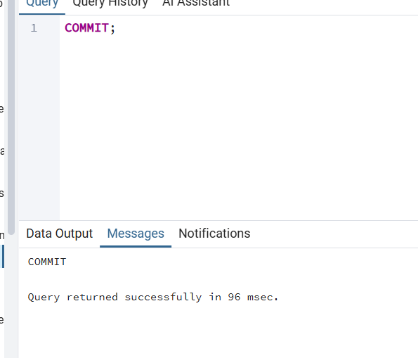

---

# 4. Procedure_1_UpdateTripStatusByOccupancy.sql

## שם הפרוצדורה

```sql
public.update_trip_status_by_occupancy()
```

## תיאור מילולי

פרוצדורה זו עוברת על כל הטיולים במערכת ומעדכנת לכל טיול את הסטטוס לפי מצב התפוסה שלו.

הלוגיקה:

```text
אם מספר המשתתפים קטן מגודל הקבוצה  → AVAILABLE
אם מספר המשתתפים שווה לגודל הקבוצה → FULL
אם מספר המשתתפים גדול מגודל הקבוצה → OVERBOOKED
```

הפרוצדורה מעדכנת את העמודה `status` בטבלת `trips` רק אם הסטטוס החדש שונה מהסטטוס הקיים.

## אלמנטים תכנותיים

הפרוצדורה כוללת:

- `PROCEDURE`
- `RECORD`
- Cursor סמוי באמצעות `FOR rec IN SELECT`
- לולאה
- `IF / ELSIF / ELSE`
- פקודת `UPDATE`
- `RAISE NOTICE`
- `EXCEPTION`

## הרצה

```sql
CALL public.update_trip_status_by_occupancy();
```

## בדיקת מצב לפני ואחרי

לפני ואחרי הרצת הפרוצדורה ניתן להשתמש בשאילתה:

```sql
SELECT 
    t.trip_id,
    t.trip_name,
    t.group_size,
    COUNT(tp.participant_id) AS registered_participants,
    t.status
FROM public.trips t
LEFT JOIN public.trip_participants tp
    ON t.trip_id = tp.trip_id
GROUP BY 
    t.trip_id,
    t.trip_name,
    t.group_size,
    t.status
ORDER BY t.trip_id
LIMIT 10;
```

## צילומי מסך

מצב לפני הרצה:

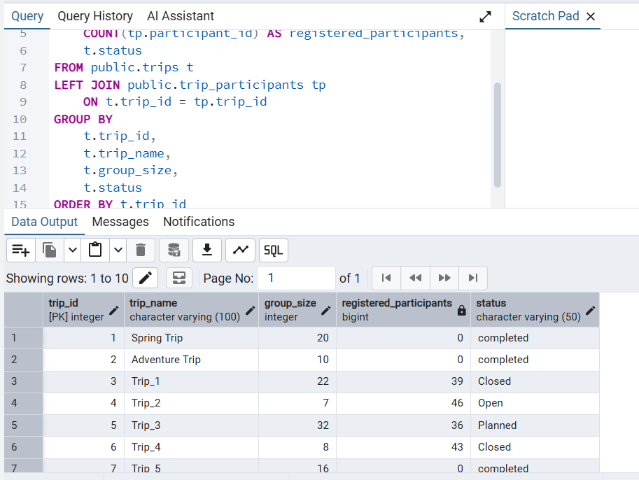

הרצת הפרוצדורה:

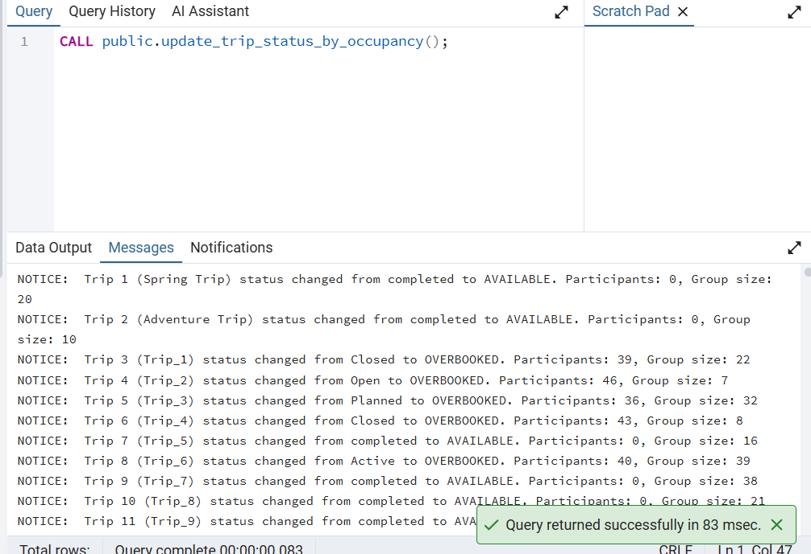

מצב אחרי הרצה:

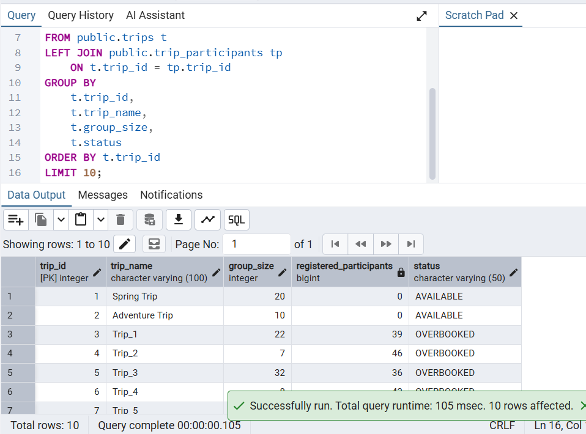

---

# 5. Procedure_2_AllocateEquipmentToTrip.sql

## שם הפרוצדורה

```sql
public.allocate_equipment_to_trip(
    p_trip_id INT,
    p_equipmentid INT,
    p_quantity INT,
    p_checkout_date DATE,
    p_return_date DATE
)
```

## תיאור מילולי

פרוצדורה זו מקצה ציוד לטיול ומעדכנת את המלאי.

הפרוצדורה מקבלת:

- מזהה טיול
- מזהה ציוד
- כמות להקצאה
- תאריך לקיחת הציוד
- תאריך החזרת הציוד

היא מבצעת בדיקות:

- הכמות חייבת להיות חיובית
- תאריך החזרה לא יכול להיות לפני תאריך לקיחה
- הטיול חייב להיות קיים
- הציוד חייב להיות קיים
- חייב להיות מספיק מלאי

אם הבדיקות עוברות:

- אם כבר קיימת הקצאה של אותו ציוד לאותו טיול, הכמות מתעדכנת.
- אם לא קיימת הקצאה, נוצרת רשומה חדשה ב־`trip_equipment`.
- לאחר מכן המלאי ב־`equipment.totalinstock` יורד בהתאם לכמות שהוקצתה.

## אלמנטים תכנותיים

הפרוצדורה כוללת:

- `PROCEDURE`
- Cursor מפורש
- `OPEN`
- `FETCH`
- `CLOSE`
- `RECORD`
- `IF / ELSE`
- `INSERT`
- `UPDATE`
- `RAISE NOTICE`
- `EXCEPTION`

## בדיקת ציוד מתאים

```sql
SELECT 
    equipmentid,
    itemname,
    totalinstock
FROM public.equipment
WHERE totalinstock >= 5
ORDER BY totalinstock DESC
LIMIT 10;
```

## הרצה לדוגמה

בדוגמה השתמשנו ב:

```text
trip_id = 1
equipmentid = 124
quantity = 1
```

```sql
CALL public.allocate_equipment_to_trip(
    1,
    124,
    1,
    CURRENT_DATE,
    CURRENT_DATE + 3
);
```

## בדיקת חריגה

```sql
CALL public.allocate_equipment_to_trip(
    1,
    124,
    999999,
    CURRENT_DATE,
    CURRENT_DATE + 3
);
```

הפרוצדורה אמורה להחזיר שגיאה על כך שאין מספיק מלאי.

## צילומי מסך

חיפוש ציוד מתאים:


מצב לפני:

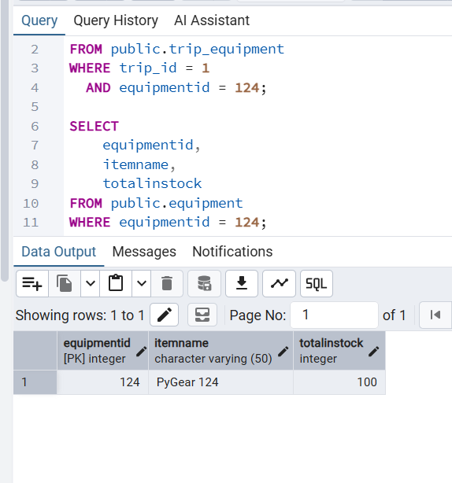

הרצה תקינה:

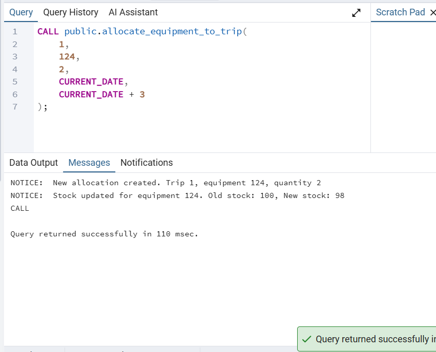

מצב אחרי:

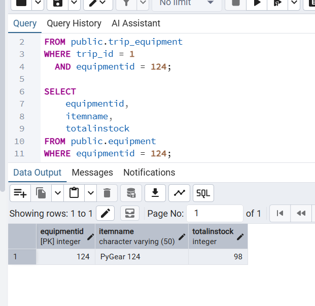

בדיקת חריגה:

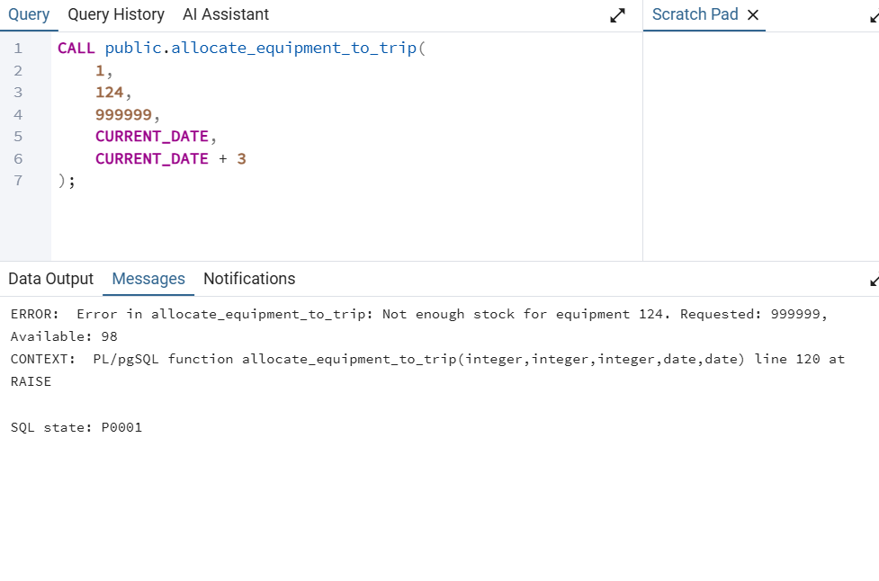

---

# 6. Trigger_1_TripStatusLog.sql

## שם הטריגר

```sql
trg_log_trip_status_update
```

## טבלה שעליה הוא פועל

```sql
public.trips
```

## מתי הוא מופעל

הטריגר מופעל אחרי עדכון של העמודה:

```sql
status
```

כלומר:

```sql
AFTER UPDATE OF status ON public.trips
```

## תיאור מילולי

כאשר סטטוס של טיול משתנה, הטריגר מכניס רשומה חדשה לטבלת `trip_status_log`.

הרשומה כוללת:

- מזהה טיול
- סטטוס קודם
- סטטוס חדש
- זמן שינוי
- המשתמש שביצע את השינוי

## אלמנטים תכנותיים

הטריגר כולל:

- `TRIGGER`
- `OLD`
- `NEW`
- `IF`
- `INSERT`
- `RAISE NOTICE`
- `EXCEPTION`

## בדיקה

לפני העדכון:

```sql
SELECT 
    trip_id,
    trip_name,
    status
FROM public.trips
WHERE trip_id = 1;

SELECT *
FROM public.trip_status_log
WHERE trip_id = 1
ORDER BY changed_at DESC;
```

הפעלת הטריגר:

```sql
UPDATE public.trips
SET status = 'FULL'
WHERE trip_id = 1;
```

אחרי העדכון:

```sql
SELECT 
    trip_id,
    trip_name,
    status
FROM public.trips
WHERE trip_id = 1;

SELECT *
FROM public.trip_status_log
WHERE trip_id = 1
ORDER BY changed_at DESC;
```

## צילומי מסך

לוג ריק לפני שינוי:


הפעלת שינוי סטטוס:

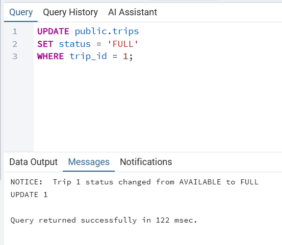

תוצאה לאחר השינוי:

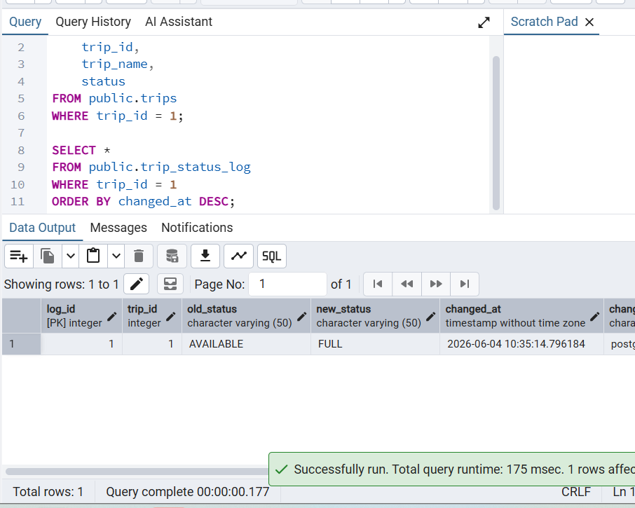

---

# 7. Trigger_2_EquipmentStockLog.sql

## שם הטריגר

```sql
trg_log_equipment_stock_update
```

## טבלה שעליה הוא פועל

```sql
public.equipment
```

## מתי הוא מופעל

הטריגר מופעל אחרי עדכון של העמודה:

```sql
totalinstock
```

כלומר:

```sql
AFTER UPDATE OF totalinstock ON public.equipment
```

## תיאור מילולי

כאשר כמות המלאי של ציוד משתנה, הטריגר מוסיף רשומה לטבלת `equipment_stock_log`.

הרשומה כוללת:

- מזהה ציוד
- מלאי קודם
- מלאי חדש
- כמות השינוי
- זמן שינוי
- המשתמש שביצע את השינוי

## אלמנטים תכנותיים

הטריגר כולל:

- `TRIGGER`
- `OLD`
- `NEW`
- `IF`
- `INSERT`
- `RAISE NOTICE`
- `EXCEPTION`

## בדיקה

לפני העדכון:

```sql
SELECT 
    equipmentid,
    itemname,
    totalinstock
FROM public.equipment
WHERE equipmentid = 124;

SELECT *
FROM public.equipment_stock_log
WHERE equipmentid = 124
ORDER BY changed_at DESC;
```

הפעלת הטריגר:

```sql
UPDATE public.equipment
SET totalinstock = totalinstock - 1
WHERE equipmentid = 124;
```

אחרי העדכון:

```sql
SELECT 
    equipmentid,
    itemname,
    totalinstock
FROM public.equipment
WHERE equipmentid = 124;

SELECT *
FROM public.equipment_stock_log
WHERE equipmentid = 124
ORDER BY changed_at DESC;
```

## צילומי מסך

מצב לפני:

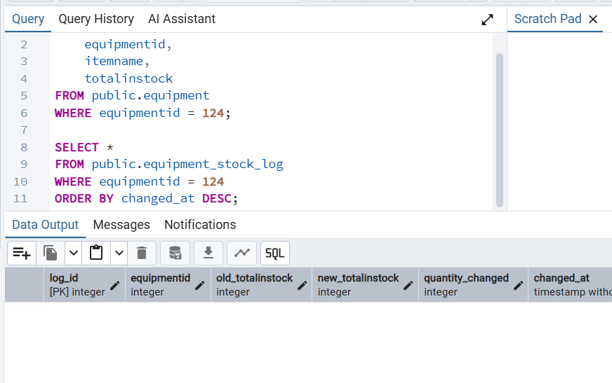

הפעלת שינוי מלאי:

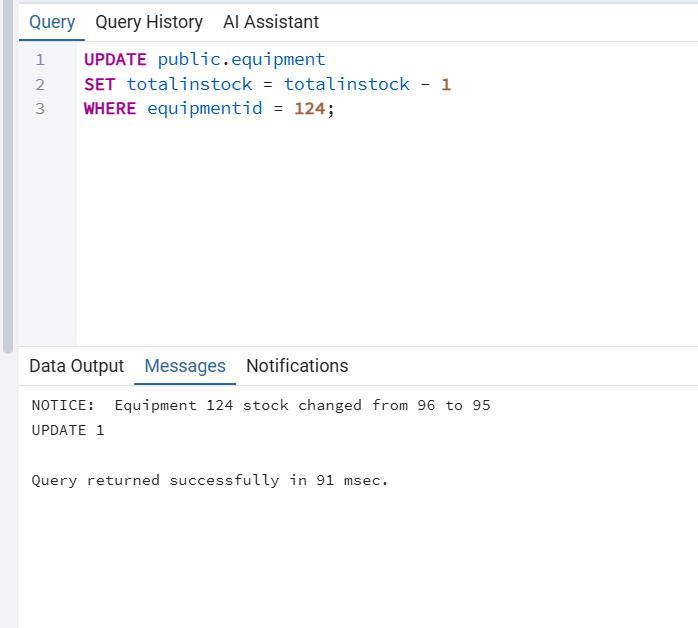

מצב אחרי:

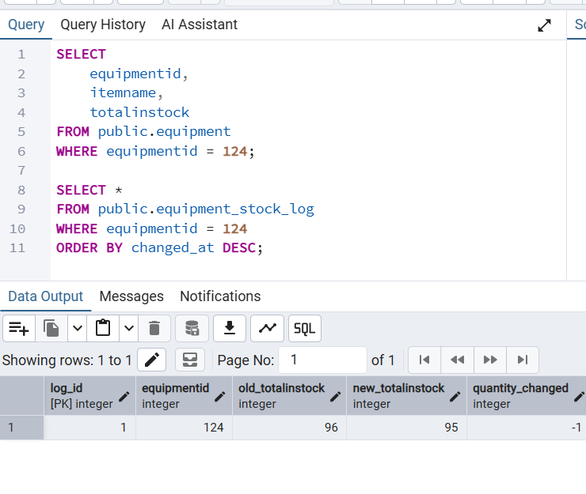

---

# 8. Main_1_TripOccupancy.sql

## תפקיד התוכנית הראשית

תוכנית ראשית זו מפעילה:

```text
Function 1  – get_trip_occupancy_summary
Procedure 1 – update_trip_status_by_occupancy
```

כלומר, היא מציגה סיכום תפוסה של טיול ולאחר מכן מעדכנת את סטטוסי כל הטיולים לפי התפוסה שלהם.

בסיום מוצגים:

- סיכום תפוסה של טיול 1
- סטטוסי טיולים אחרי עדכון
- רשומות אחרונות מתוך `trip_status_log`

## איך להריץ

ניתן להריץ את כל הקובץ `Main_1_TripOccupancy.sql` ב־pgAdmin.

הקוד המרכזי:

```sql
SELECT *
FROM public.get_trip_occupancy_summary(1);

CALL public.update_trip_status_by_occupancy();

SELECT 
    t.trip_id,
    t.trip_name,
    t.group_size,
    COUNT(tp.participant_id) AS registered_participants,
    t.status
FROM public.trips t
LEFT JOIN public.trip_participants tp
    ON t.trip_id = tp.trip_id
GROUP BY 
    t.trip_id,
    t.trip_name,
    t.group_size,
    t.status
ORDER BY t.trip_id
LIMIT 10;

SELECT *
FROM public.trip_status_log
ORDER BY changed_at DESC
LIMIT 10;
```

## הוכחת הרצה

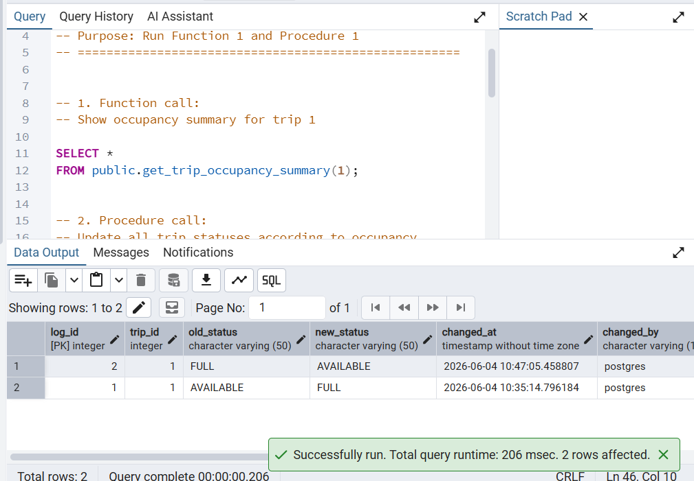

בתמונה ניתן לראות שהתוכנית רצה בהצלחה, ובפלט מוצגות רשומות מתוך `trip_status_log`, כלומר עדכוני הסטטוס נרשמו בהצלחה.

---

# 9. Main_2_LogisticsEquipment.sql

## תפקיד התוכנית הראשית

תוכנית ראשית זו מפעילה:

```text
Function 2  – get_logistics_by_region_cursor
Procedure 2 – allocate_equipment_to_trip
```

כלומר, היא מציגה מידע לוגיסטי לפי אזור באמצעות Ref Cursor, ולאחר מכן מקצה ציוד לטיול ומעדכנת את מלאי הציוד.

בסיום מוצגים:

- תוצאת ה־cursor
- הקצאת ציוד לפני ואחרי
- מלאי ציוד לפני ואחרי
- רשומות אחרונות מתוך `equipment_stock_log`

## איך להריץ

בגלל שיש שימוש ב־Ref Cursor, מומלץ להריץ את החלק הראשון בשלבים.

### חלק ראשון – הפונקציה שמחזירה Cursor

```sql
BEGIN;

SELECT public.get_logistics_by_region_cursor('North');
```

לאחר מכן:

```sql
FETCH ALL FROM logistics_cursor;
```

ולסיום:

```sql
COMMIT;
```

אם יש שגיאה באמצע, יש להריץ:

```sql
ROLLBACK;
```

### חלק שני – הפרוצדורה שמקצה ציוד

```sql
SELECT *
FROM public.trip_equipment
WHERE trip_id = 1
  AND equipmentid = 124;

SELECT 
    equipmentid,
    itemname,
    totalinstock
FROM public.equipment
WHERE equipmentid = 124;

CALL public.allocate_equipment_to_trip(
    1,
    124,
    1,
    CURRENT_DATE,
    CURRENT_DATE + 3
);

SELECT *
FROM public.trip_equipment
WHERE trip_id = 1
  AND equipmentid = 124;

SELECT 
    equipmentid,
    itemname,
    totalinstock
FROM public.equipment
WHERE equipmentid = 124;

SELECT *
FROM public.equipment_stock_log
WHERE equipmentid = 124
ORDER BY changed_at DESC
LIMIT 10;
```

## הוכחות הרצה

החזרת cursor:

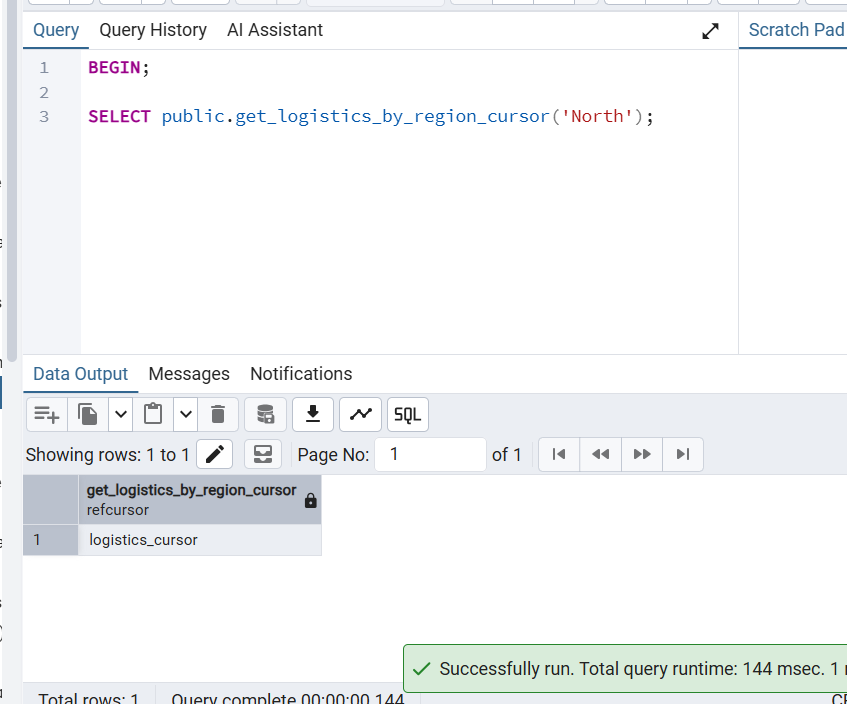

שליפת הנתונים מה־cursor:

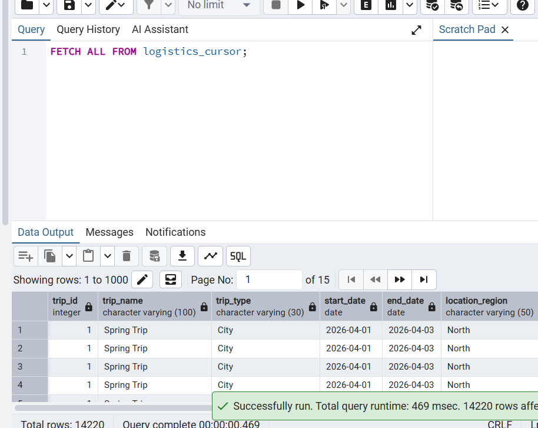

סיום טרנזקציה:

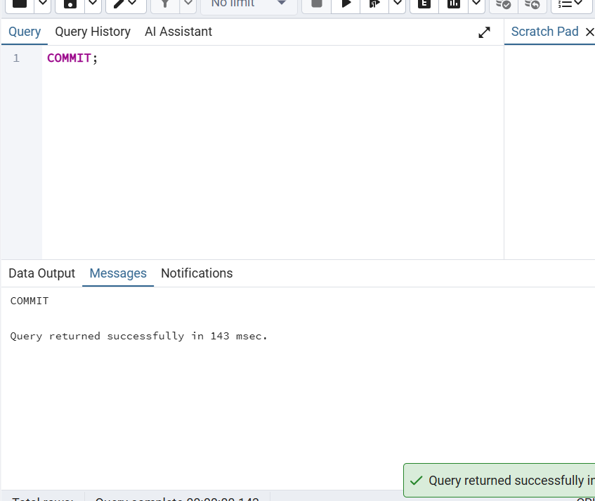

הרצת המשך התוכנית והצגת לוג מלאי:

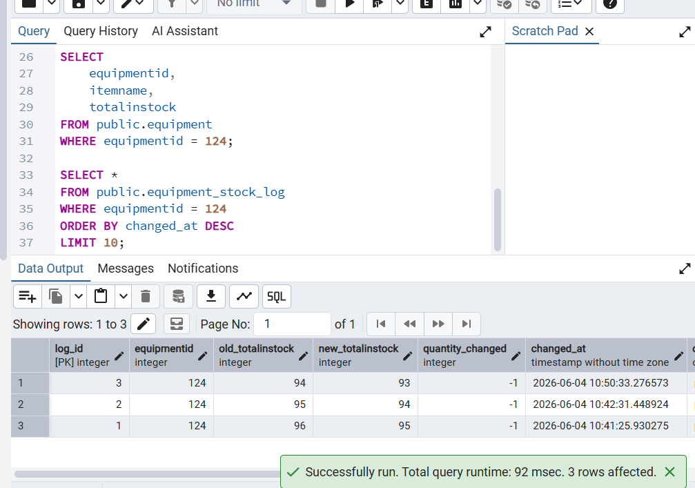

---

# בדיקה שכל האובייקטים קיימים בבסיס הנתונים

אפשר להריץ את השאילתה הבאה כדי לוודא שכל הפונקציות והפרוצדורות קיימות:

```sql
SELECT routine_name, routine_type
FROM information_schema.routines
WHERE routine_schema = 'public'
  AND routine_name IN (
      'get_trip_occupancy_summary',
      'get_logistics_by_region_cursor',
      'update_trip_status_by_occupancy',
      'allocate_equipment_to_trip'
  )
ORDER BY routine_type, routine_name;
```

ואת השאילתה הבאה כדי לוודא ששני הטריגרים קיימים:

```sql
SELECT 
    trigger_name,
    event_manipulation,
    event_object_table,
    action_timing
FROM information_schema.triggers
WHERE trigger_schema = 'public'
  AND trigger_name IN (
      'trg_log_trip_status_update',
      'trg_log_equipment_stock_update'
  )
ORDER BY trigger_name;
```

---

# סיכום שלב ד

בשלב זה נוספו לבסיס הנתונים תוכניות PL/pgSQL שמרחיבות את התנהגות המערכת מעבר לשאילתות רגילות.

הפונקציה הראשונה מנתחת תפוסת טיול ומחזירה סטטוס מומלץ.  
הפונקציה השנייה מחזירה מידע לוגיסטי לפי אזור באמצעות `Ref Cursor`.  
הפרוצדורה הראשונה מעדכנת סטטוסים של טיולים לפי תפוסה.  
הפרוצדורה השנייה מקצה ציוד לטיול ומעדכנת מלאי.  
הטריגר הראשון מתעד שינויי סטטוס של טיולים.  
הטריגר השני מתעד שינויי מלאי ציוד.  
שתי התוכניות הראשיות מריצות כל אחת פונקציה ופרוצדורה ומציגות פלט שמוכיח את פעולתן.

השלב כולל שימוש באלמנטים הנדרשים:

- Cursor סמוי
- Cursor מפורש
- Ref Cursor
- פקודות DML: `INSERT`, `UPDATE`
- הסתעפויות `IF`
- לולאות
- טיפול בחריגות `EXCEPTION`
- רשומות `RECORD`
- טריגרים עם `OLD` ו־`NEW`

